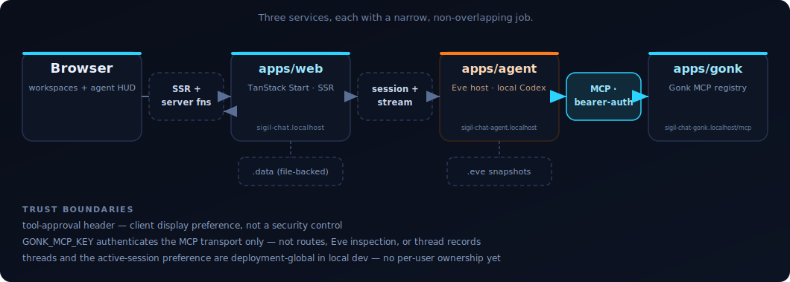

<p align="center"></p>

An agentic chat template with deliberately narrow ownership:

- **Sigil** renders the TanStack Start chat client.
- **Local Codex** serves the model through the existing `codex login` session and ChatGPT subscription.
- **Eve** owns durable sessions, streaming, interruption, and the native tool host; tool approval is a client-side UI preference.
- **Gonk** supplies the application tool registry, authorization, skills, memory, and scope contracts that Eve hosts in-process.

## Architecture

<p align="center"></p>

Two services, each with a narrow job:

| Service     | App          | Owns                                                                                         | Portless URL                             |
| ----------- | ------------ | -------------------------------------------------------------------------------------------- | ---------------------------------------- |
| Chat client | `apps/web`   | TanStack Start UI, human authentication, uploads, artifacts, and web-owned repository access | `http://sigil-chat.localhost:1355`       |
| Agent host  | `apps/agent` | Eve sessions/model calls plus native, authenticated Gonk application-tool dispatch           | `http://sigil-chat-agent.localhost:1355` |

Those are the primary-checkout URLs. In a linked worktree, Portless prefixes
both with the same branch-derived namespace—for example,
`http://feature-auth.sigil-chat.localhost:1355` and
`http://feature-auth.sigil-chat-agent.localhost:1355`. The apps derive their
sibling-service URLs from that namespace unless an explicit topology override
is set, so multiple full stacks can run without colliding.

Application tool definitions live in `packages/agent-tools`. Eve projects that
registry natively through `apps/agent/agent/tools/gonk.ts`; there is no copied
tool list, MCP bridge, third process, shared service bearer, or fallback path.

## What's new

The current development slice embeds Gonk in Eve, shares artifact and tasking
repositories with TanStack, removes the internal MCP bridge, and makes a fresh
worktree a two-service zero-configuration start.

See [`What changed in July 2026`](docs/guides/whats-new-2026-07.md) for the
ELI5 explanation, implementation map, security boundaries, and the UI/deployed
proof that remains open.

## Run locally

Requires Node 24, [Portless](https://www.npmjs.com/package/portless)
(`npm i -g portless`), and a one-time `codex login`. Everything else resolves
from the repository and public npm.

```bash
pnpm dev
```

The launcher synchronizes the frozen install, generates a worktree-local agent
binding secret, applies idempotent auth migrations, seeds a development owner,
and starts the two branch-namespaced services. It then proves the authenticated
web → Eve → native application-tool path, prints one readiness summary, and opens a private
single-use URL that creates a normal owner session and lands on `/chat`.
“Ready” therefore means the account store, agent bearer flow, local Codex model
session, and native application-tool registry responded—not merely that two
ports are listening.

To reset only the current worktree's disposable app state, stop its dev stack
and run `pnpm dev:reset`. The command moves `.data` and Eve state into a
recoverable backup under Git's shared metadata and leaves the worktree empty.
Restore it with the exact `pnpm dev:restore <backup>` command printed by reset.
The next `pnpm dev` invocation rebuilds the database, credentials, and owner so
the normal startup path is the first-run path. Reset does not touch `.env`, the
external roadmap repository, or another worktree.

See [Development without ceremony](docs/guides/development.md) for the normal
edit/verify loop, branch-worktree behavior, reset/restore recovery, and the
short troubleshooting path.

Eve's `experimental_chatgpt()` model
reads that local login and calls the Codex backend directly; Sigil Chat does not
use Vercel AI Gateway. The template's model is the checked-in `agent.model` in
`fixtures/application/sigil-chat.yaml`. The web and agent processes share a
private `SIGIL_AGENT_BINDING_SECRET` used only for signed session and scope
bindings; local development generates it automatically.

The web process owns human authentication. Local development keeps the database
and owner-only auth secret under the worktree's single `SIGIL_DATA_DIR`.
Production must provide `SIGIL_PUBLIC_URL`, a `BETTER_AUTH_SECRET` of at least
32 characters, and a stable `SIGIL_INSTALLATION_ID`; `SIGIL_DATABASE_URL` is
only needed for a database outside `SIGIL_DATA_DIR`. Server startup fails closed
while the latest committed migration is absent. Owner-issued member invitations
are single-use and expire within 24 hours; production also requires a stable
`SIGIL_INVITE_TOKEN_PEPPER_FILE`. Registration policy is the checked-in
fixture's `auth.registration` value and defaults to `closed`.

Google, Okta, GitHub, and Discord can be enabled independently with the
provider-specific `SIGIL_AUTH_*` variables in [`.env.example`](.env.example).
The login page renders only providers whose complete credential set is present;
partial configuration fails at startup. These methods sign in existing users
and do not bypass the installation's registration or invitation policy. With
closed registration, a provider-verified matching email may link to an
owner/invite-created account; open registration additionally requires that the
local email was already verified.

When `RESEND_API_KEY` and `SIGIL_AUTH_EMAIL_FROM` are both configured, the app
also enables magic-link sign-in, email verification, and password recovery.
The Security settings page lists connected sign-in methods and lets a user link
or unlink configured providers while preserving at least one usable account.

`fixtures/application/sigil-chat.yaml` is the checked-in Mirk fixture for
product branding and behavior. `SIGIL_PUBLIC_URL` is the single deployment
origin used by Better Auth, trusted-origin defaults, Eve's JWT issuer, and
public metadata. Eve normally derives JWKS discovery from it; deployments may
route retrieval internally with `SIGIL_EVE_AUTH_JWKS_URL` without changing the
issuer.

The browser obtains a five-minute, Eve-audience JWT from the authenticated web
session. Eve verifies it against the web app's JWKS and binds every created Eve
session to the verified subject before returning its session id. Ordinary local
development uses that real flow; the unauthenticated development bypass is
reserved for deliberate host-level tests and is rejected in production. See
[`.env.example`](.env.example) for the complete auth environment surface.

Image instruction-editing uses the local image gateway's OpenAI-compatible
`/v1/images/edits` endpoint. It defaults to `http://localhost:4000`; override
that with `SIGIL_IMAGE_EDIT_GATEWAY_URL` and, when the gateway requires a
bearer, set `SIGIL_IMAGE_EDIT_GATEWAY_KEY`. The edit tool fails explicitly
when that backend is unavailable or rejects the request. It never falls back
to text-to-image generation.

## Add a tool

New tools live in one place, [`packages/agent-tools/src`](packages/agent-tools/src).
Here is the simplest real tool in the registry, `sigil-chat-status`:

```ts
registry.register({
  name: "sigil-chat-status",
  description:
    "Report the live Sigil Chat runtime architecture and server time.",
  visibility: "always",
  approval: "read",
  input: shape<Record<string, never>>(
    isEmptyObject,
    "Expected an empty object.",
  ),
  inputJsonSchema: emptyObjectSchema(),
  hints: readHints,
  handler: async () => ({
    data: {
      application: "sigil-chat",
      agentRuntime: "eve",
      toolRegistry: "gonk",
      graphModel: "typed-reducer-graph",
      transport: "in-process-eve-tools",
      serverTime: new Date().toISOString(),
    },
  }),
});
```

1. Add the definition in `packages/agent-tools/src` and register it in `packages/agent-tools/src/registry.ts`.
2. Eve's native Gonk resolver discovers it on the next step; there is no connection file or transport configuration to update.
3. Set the client's tool-approval preference to "ask" and drive it from `/chat` to see the approval prompt and result.

See [`adding-a-tool.md`](docs/guides/adding-a-tool.md) for approval tiers, the
native-host authorization boundary, and full verification steps.

## Install a UI component

`packages/ui` components install from the Sigil Design registry as owned
source, not a dependency — you get the file in your tree and restyle freely.
Add the registry to `components.json` once:

```json
{
  "registries": {
    "@sigil": "https://ui.nightwork.dev/r/{name}.json"
  }
}
```

Then install any component by name:

```bash
pnpm dlx shadcn@latest add @sigil/<name>
```

Browse what's available at the Sigil Design repo's `/showcase` catalog — the
always-current source of truth for every component that exists.

## Extending

Task-oriented guides in [`docs/guides/`](docs/guides/) cover the things
this README only points at:

- [`whats-new-2026-07.md`](docs/guides/whats-new-2026-07.md) — a plain-language
  summary of the native Eve-hosted Gonk cutover, shared repositories, tasking,
  authorization, and migration.

- [`adding-a-tool.md`](docs/guides/adding-a-tool.md) — the end-to-end worked
  path for a new application tool, using the real `sigil-chat-status` tool as
  the example: registry shape, approval tiers, and how to verify a new tool
  through Eve's native host and in chat.
- [`customizing-the-agent.md`](docs/guides/customizing-the-agent.md) — the
  `apps/agent` anatomy: model config, system instructions, the Eve channel,
  adding an optional external connection, subagents, and resetting local `.eve`
  state.
- [`configuration.md`](docs/guides/configuration.md) — the small normal
  production surface, optional integrations, and why deployment-only storage
  overrides are not part of fresh-worktree setup.
- [`building-workspaces.md`](docs/guides/building-workspaces.md) — the
  route/content split, and the two loops that keep a workspace and the agent
  in sync: a tool result becoming a React Query cache update via
  `@zigil/agent-react-query` domain outcomes, and workspace selection state
  reaching the agent through the attention/context tray.
- [`rebranding-the-app.md`](docs/guides/rebranding-the-app.md) — one public
  branding configuration for app chrome, browser/share metadata, the PWA
  manifest, and worktree-specific tab titles and procedural favicons.
- [`trimming-the-template.md`](docs/guides/trimming-the-template.md) — the
  honest boilerplate map: which routes and workspace packages are core,
  which are pattern-reference demos, which are inherited `sigil-design`
  scaffold, backed by real import greps, plus a deletion recipe.

## Trust model

The tool-approval mode is a client-side UI preference transmitted via the
`x-sigil-tool-approval` header; it is not a security control, and any client can
set it. Gonk's registry `ApprovalProvider` is the consent-policy boundary for
tool execution; Eve's verified session principal establishes identity but does
not turn the browser preference into authority. Native tool discovery and
invocation re-run live scope, role, caller, and persona authorization.

Agent threads are membership-scoped: every thread record carries
`members: string[]`, and list/get/create/fork/rename/archive/snapshot
operations filter by `isMember(thread.members, userId)`
(`agent-threads-domain.ts`). The active-thread preference is per-principal
and also carries the active project/workspace container selection
(PRODUCT-CHROME-REWORK-SPEC §3.1). The application container tools
(`packages/agent-tools/src/containers.ts`) also enforce project membership on
workspace access and existing owner authority on project mutation. Project and
workspace updates use revision-checked shared-repository writes; member-management
UI remains outside this release.

Session and capability-catalog access is application authorization, not tool
approval state. Eve verifies the web-issued principal and rejects continuation
or stream access when the persisted session owner differs from the verified
subject. The current agent
catalog projection is read-only and removes host filesystem paths.

Persisted agent-thread runtime envelopes are Sigil-owned and schema-versioned;
the `@zigil/agent-eve` adapter translates their event projection for Eve.
Those envelopes still include a resumable continuation token and are acceptable
only under this local trust model. The required retention, redaction,
secret-storage, and owner-scoped resume contract is tracked in
[`docs/specs/AGENT-SESSION-RETENTION-ISSUE.md`](docs/specs/AGENT-SESSION-RETENTION-ISSUE.md).

Add application tools in [`packages/agent-tools/src`](packages/agent-tools/src).
[`apps/agent/agent/tools/gonk.ts`](apps/agent/agent/tools/gonk.ts) hosts that
registry through `@gonk/eve-host/tools`; tools should not be copied into Eve
definitions by hand.

## Use as a template

Sigil Chat is generated from the Sigil Design base plus this repository's
versioned Chat overlay. Do not copy this reference checkout or revive its old
vendored scaffold CLI.

1. Install or build the current Sigil Design CLI, then generate through the
   published overlay (or a local checkout while developing both repositories):

   ```bash
   sigil create my-project \
     --profile chat \
     --overlay @sigil-design/chat-overlay
   cd my-project
   ```

2. Review `.env.example` only when deployment overrides are needed. Ordinary
   local development derives its Portless topology and credentials automatically.

3. Run `codex login`, then start the app. The local launcher synchronizes the
   install and prepares the agent binding secret, database, and development owner
   automatically:
   ```bash
   pnpm dev
   ```

See [`docs/guides/`](docs/guides/) for the task-oriented usage/extension
guides ("Extending" above), [`docs/specs/README.md`](docs/specs/README.md)
for the index of active specs, historical evidence records, and material
inherited from the `sigil-design` lineage that doesn't apply to this product
— and [`.agents/index.md`](.agents/index.md) (symlinked from `CLAUDE.md` /
`AGENTS.md`) for the full agent-facing project orientation.
