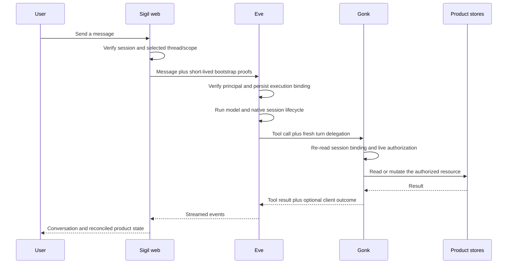

# How Eve and Gonk work together

Sigil Chat now has one agent turn pipeline instead of a stack of overlapping
adapters:

- **Eve runs the conversation.** It owns sessions, messages, streaming,
  interruption, tool-input responses, attachments, and the live `todo` list.
- **Gonk runs application capabilities.** It owns tool discovery, authorization,
  memory, persona, skills, retrieval, and mutations of product resources.
- **Sigil Chat joins them.** The web app authenticates the user and selects the
  application thread, persona, and resource scope. It does not redefine Eve or
  Gonk.

That split is the main simplification. A Slack message, browser message, or
future iMessage bridge should enter through Eve and then use the same Gonk tool
path. Channels do not get their own tool registry, authorization model, or task
database.

## One turn, end to end

The web app performs one authenticated turn bootstrap. The session-binding
proof and optional scope proof remain separate claims, but they travel in the
same request to Eve. Eve verifies them before execution and records the
immutable application-thread binding.

Immediately before each Gonk tool call, Eve signs a short-lived delegation that
binds the verified human, application thread, persona, Eve session, turn, and
active scope. Gonk checks that delegation against both the durable binding and
current resource authorization. A warm MCP connection therefore cannot keep an
old user's authority after membership or scope access changes.

`GONK_MCP_KEY` is the internal secret used to sign and verify these service
claims. It is not a human credential. Browser clients and third-party MCP
clients must never receive it.

The authenticated public `/api/mcp` gateway is the deliberate non-Eve
exception. Because it has no Eve turn, the web server authenticates the user's
API key and sends a separate server-signed user/scope proof with the internal
service hop. Gonk still performs live authorization; the service secret alone
is never enough.

## Live todos are not durable work items

There are two deliberately different task concepts:

| Concept         | Owner                                          | Lifetime                              | What it may change                                  |
| --------------- | ---------------------------------------------- | ------------------------------------- | --------------------------------------------------- |
| Eve `todo`      | Eve                                            | Current execution session             | The agent's live checklist only                     |
| Sigil work item | Product work-items store, exposed through Gonk | Durable across sessions and harnesses | Product work state through explicit work-item tools |

The deleted app-owned session-todo store used to create a parallel source of
truth. Eve's native `todo` tool replaces it.

When a durable work item matters to the current conversation, the agent can use
`sigil-session-commitment-link` to attach it to the trusted application thread.
`sigil-session-commitment-list` and `sigil-session-commitment-unlink` inspect or
remove that relationship. The thread id comes from Eve's verified delegation,
not from tool input.

A commitment link does not grant access and does not change the work item's
lifecycle. Completing an Eve todo never means that durable work is verified,
shipped, accepted, assigned, or reprioritized. Those changes still require the
corresponding Gonk work-item operation. New feature or workflow requests also
begin in the lower-authority request-intake system; they do not silently become
commitments.

## What was removed

The convergence deliberately removes parallel paths:

- `@zigil/agent-eve` is no longer an application dependency; the web app uses
  `eve/react` and `eve/client` through one temporary app-owned compatibility
  seam.
- Two independent web proof-minting calls became one turn bootstrap.
- The app-owned session todo store and authored todo tool were deleted in favor
  of Eve's framework tool.
- Eve no longer forwards browser proofs to Gonk or treats the static service
  secret as human authority.
- Application tools remain registered once in Gonk and discovered by Eve over
  MCP; there is no hand-copied Eve tool list.

The remaining compatibility seam is
`apps/web/src/lib/eve-runtime-session.ts`. It preserves Sigil-specific
attachment and terminal-outcome behavior while published UI packages still use
the neutral agent surface. It stays app-owned and should be deleted after the
upstream `@zigil/agent-react` split makes direct Eve types possible; it should
not become another package.

## Migrating an existing instance

Treat this as a coordinated runtime upgrade, not a rolling protocol change:

1. Stop the web, Eve, and Gonk processes together. Old static-auth Eve and the
   new delegated-auth Gonk server are not a supported mixed-version pair.
2. Keep Node 24, update from the repository lockfile, and run
   `pnpm install --frozen-lockfile`. The web and agent apps must both resolve
   Eve `0.27.0`, including the tracked `patches/eve@0.27.0.patch`.
3. Remove `@zigil/agent-eve` from any instance-owned manifest or import. Use the
   app-owned `eve-runtime-session.ts` seam while retained UI packages still
   require the neutral session contract; do not publish another wrapper.
4. Put one `GONK_MCP_KEY` of at least 32 bytes in the root `.env`, available to
   all three services. The web app needs it for turn bootstrap, Eve for
   per-tool delegation, and Gonk for verification. If the old value is weak,
   rotate it and restart all three services; outstanding short-lived proofs
   will correctly stop working.
5. Restart the complete stack and verify the Eve info endpoint reports the
   framework `todo` tool, then exercise one authorized Gonk read and one denial
   after scope revocation.

This slice adds no application database schema migration. Continue to run the
normal `pnpm auth:migrate` setup/check when bringing up an updated checkout, but
there is no Eve/Gonk-specific auth row transformation.

The old `sigil-chat.session-todos.v1` KV namespace is no longer read. Its items
are deliberately not promoted into durable work items because doing so would
invent ownership, priority, and lifecycle state. Existing durable work items
remain in the work-items store; they gain a session relationship only after an
explicit commitment link.

Do not delete thread records or `.eve` state merely to perform this upgrade.
The repository verifies cold boot, event projection, cursors, cancellation, and
terminal outcomes, but it does not claim a production in-place snapshot
migration proof. Back up non-disposable Eve state and prove resume in a staging
copy before upgrading a real long-lived deployment.

Instances with custom code have two additional checks:

- replace copied static Gonk auth with the execute-time `auth` callback used in
  `apps/agent/agent/connections/gonk.ts`; the tracked Eve patch is required so
  headers and credentials are resolved for every tool invocation;
- make every custom channel produce the same verified Eve execution binding
  before it is allowed to call user-scoped Gonk tools.

## Adding another channel

The browser is currently the admitted channel. Slack is the next useful
real-world validator because Eve already provides `eve/channels/slack`.
iMessage has no Eve-owned channel and therefore needs one small app-local Eve
adapter around the selected bridge.

Both channels have the same admission gate:

1. Authenticate the external sender at the channel boundary.
2. Resolve an explicit server-owned link from the external identity to a Sigil
   user; never guess from a display name or email-shaped string.
3. Check channel and resource membership.
4. Produce the same Eve execution binding used by the web channel.
5. Let Eve mint the normal per-tool Gonk delegation.

Until identity linking and membership exist, a connector may prove transport,
threads, replies, files, cancellation, and human-in-the-loop behavior, but it
must not reach user-owned Gonk resources.

## Extending the system without rebuilding it

- Add an application tool in `apps/gonk/src/registry.ts`; do not add a matching
  Eve tool definition.
- Add conversation behavior in Eve instructions, channel composition, or a
  genuine Eve connection—not in a new generic agent abstraction.
- Add product reconciliation through the existing domain-outcome and React
  Query path.
- Add durable task behavior through the work-items store and Gonk tools; keep
  transient execution planning in Eve `todo`.
- Reuse the turn-delegation path for every admitted Eve channel.

The detailed contract and remaining package/channel phases are in
[`EVE-NATIVE-CHANNELS-AND-PACKAGE-MIGRATION-SPEC.md`](../specs/EVE-NATIVE-CHANNELS-AND-PACKAGE-MIGRATION-SPEC.md).
