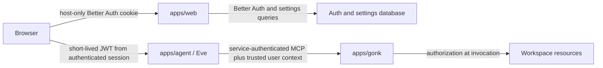

# Authentication and user settings

> Date: 2026-07-18
> Status: ratified architecture contract; implementation pending
> Owner: Sigil Chat application composition
> Related: `AGENT-SESSION-RETENTION-ISSUE.md`, `AGENT-CONTEXT-AWARENESS-SPEC.md`, `GONK-MCP-AUTH-INTEGRATION-SPEC.md`

## Summary

Sigil Chat will use Better Auth for human accounts and browser sessions, with
username/password as the visible sign-in method. Authentication terminates in
`apps/web`. The authenticated principal is then carried explicitly into Eve and
Gonk; neither the browser's tool-approval preference nor possession of the
internal `GONK_MCP_KEY` stands in for user identity.

User settings are owned by Sigil Chat and keyed by the authenticated user.
Workspace- and channel-specific settings add a second scope coordinate, but
settings never grant access. Authorization remains a server-side decision over
the authenticated principal and requested resource.

The collaboration model is also ratified: `defineAgent` is the authored,
versioned base; a Gonk persona is the durable individual; an Eve execution
session binds immutably to exactly one persona; and a channel is the shared
container whose explicit participant set may include humans and persona-bound
Eve sessions. There is no separate scene object. Resource scope says where data
lives; channel membership and authorization say who may access it.

The first release is deliberately small:

- first-user setup and optional explicitly enabled registration;
- username/password sign-in backed by Better Auth;
- account, password, active-session, appearance, and agent-preference settings;
- owner-scoped channels, explicit participants, and active-channel preference;
- authenticated Web-to-Eve calls with a short-lived service token;
- trusted principal propagation toward Gonk's invocation boundary.

OAuth, organizations, invitations, billing, API keys, passkeys, two-factor
authentication, and public password-recovery email are not part of the first
release.

## Why this boundary

Deadletters provides the useful reference shape, not a package to copy whole.
Its implementation establishes several good patterns:

- `packages/auth/src/server.ts` keeps Better Auth server configuration in one
  place and exposes a deliberately narrowed surface;
- `packages/auth/src/provider.ts` separates application session semantics from
  Better Auth's inferred types;
- `packages/auth/src/helpers.ts` provides fail-closed `requireAuth` and
  `requireAdmin` helpers;
- `apps/web/lib/route-auth.ts` makes public routes an explicit allow-list;
- account identity and public content profiles remain separate records;
- the first account can bootstrap administrative ownership without a manual
  database edit.

Sigil Chat should adopt those seams, but not Deadletters' current breadth. It
does not yet have a second consumer that earns a reusable auth package, and it
does not need Deadletters' admin plugin, OAuth providers, API keys, invitations,
content profiles, or Turso-specific product assumptions. Auth stays app-local
under `apps/web/src/lib/auth/` until a real second application consumes the same
contract.

## Terminology and scope axes

These concepts must not be collapsed into one generic `scope` value.

| Concept | Meaning | Example |
| --- | --- | --- |
| User | Human identity authenticated by Better Auth | `user_01...` |
| Installation | One deployed Sigil Chat product instance | `local` initially |
| Workspace surface | Product capability surface and its available resources | `studio`, `review`, `chat` |
| Channel | Durable collaboration container with an explicit participant set | `channel_01...` |
| Channel participant | Human member or persona-bound Eve execution session | `user_01...`, `eve_session_01...` |
| Eve execution session | One execution history, immutably bound to one principal and one persona | `session_01...` |
| Gonk persona | Durable individual identity, self-model, memory, skills, and artifacts | `persona_01...` |
| Gonk scope tier | Resource-resolution coordinate, never membership or authority | `project`, `session` |

`@gonk/scope` is informative for resource resolution, but its published tiers
are not authenticated-user or tenant boundaries. A project-scoped Gonk store is
still shared unless the application keys and authorizes records by user. Never
infer ownership from a directory, workspace selection, client context, or Gonk
scope tier.

## Product decisions

### Authentication method

The UI signs in with `username` and `password` using Better Auth's username
plugin. The plugin extends Better Auth's email/password authenticator rather
than replacing it. Better Auth still requires an email and name when an account
is created.

Consequently:

- sign-in presents EMAIL and password (revised, David 2026-07-18: email is the login identifier — Better Auth core default; the username plugin remains for the mention-handle, not for sign-in);
- first-user setup and registration collect EMAIL and PASSWORD ONLY — username defaults to the email local-part and display name defaults from it, both editable later in Settings → Account ("Shouldn't it just be email/password with the ability to edit profile in settings?");
- email IS the login key (superseding the earlier private-metadata stance); username is the mention-handle and profile identity, edited in settings;
- the implementation must not fabricate synthetic email addresses to evade
  Better Auth's account model;
- username is normalized to lowercase and is the unique stable login handle;
- display name is mutable presentation data and is not an authorization key.

Username policy:

- 1–32 characters (self-hosted install: no squatting/enumeration concerns; a 2-char owner name like "dr" is fine — the 3-char floor was public-platform convention, removed per David 2026-07-18);
- lowercase ASCII letters, numbers, dots, underscores, and hyphens;
- must begin and end with a letter or number;
- case-insensitive uniqueness after normalization;
- reserved product and route names such as `admin`, `api`, `auth`, `eve`,
  `gonk`, `settings`, and `system` are rejected;
- username-availability enumeration is not exposed as a public endpoint in v1.

Password policy:

- 8–128 characters (Better Auth default floor; the 12 minimum was our own cargo-cult addition — removed per David 2026-07-18), ALL characters allowed incl. spaces/symbols, no composition rules;
- Better Auth's default password hashing implementation;
- generic sign-in failure messages;
- changing a password requires the current password and revokes other
  sessions;
- rate limiting is enabled in every environment, with stricter rules on sign-in
  and account creation.

### Registration and first-run setup

A fresh installation with no users exposes `/setup`. The successful setup
transaction creates the first user with role `owner` and closes the bootstrap
path. Concurrent first-user submissions must be serialized by the database so
two owners cannot be created.

After bootstrap, public registration is closed by default. It may be enabled
explicitly for a demo or controlled deployment with
`SIGIL_AUTH_REGISTRATION=open`; new accounts receive role `member`. There is no
UI switch whose untrusted browser value can open registration.

Invites and administrator-created users are a later feature. Production
deployments that need self-service password recovery must configure verified
email delivery before advertising the feature; v1 local deployments are
administrator-recovery only.

### Roles

V1 defines only:

- `owner`: installation administration and all member capabilities;
- `member`: authenticated product use.

Roles are server-authored user fields. They may appear in a signed service
token, but a route or tool must still make its own authorization decision.
Workspace roles and organizations are deferred. Channel membership is not: the
channel record has an explicit, discriminated participant set from its first
version, even while v1 product policy admits only one human owner and one
persona-bound Eve session.

## Architecture



### Web application

`apps/web` owns:

- the Better Auth instance and client;
- auth database connection and migrations;
- `/api/auth/$` GET/POST handlers;
- `/login` and `/setup`;
- `getSession`, `requireSession`, and `requireOwner` server helpers;
- user-settings validation and persistence;
- route protection and redirect behavior;
- minting short-lived JWTs for Eve through Better Auth's JWT/JWKS plugin.

Use Better Auth's `tanstackStartCookies()` plugin last in the server plugin
array so server-side sign-in and sign-up operations set cookies correctly.
Cookies remain host-only. Do not enable cross-subdomain cookies to make the Eve
service appear authenticated.

The current root route mounts `AppAgentSessions` around every route. That must
change before `/login` or `/setup` is added: unauthenticated routes must render
without fetching the channel catalog or creating an Eve client. Mount the agent
session provider only inside the protected application layout.

### Eve authentication

The browser continues to call Eve directly for streaming, but supplies a
short-lived bearer token obtained from the authenticated web application.
`useEveRuntimeSession` already accepts an async bearer resolver, so tokens can
be refreshed per request without storing them in `localStorage`.

The token contract is:

```ts
interface SigilAgentTokenClaims {
  iss: string
  aud: "sigil-chat-agent"
  sub: string              // Better Auth user id
  role: "owner" | "member"
  installationId: string
  iat: number
  exp: number              // no more than 5 minutes after iat
}
```

Eve verifies signature, issuer, audience, expiry, and required claims against
the web app's JWKS endpoint. It then creates the Eve caller principal from the
verified claims. `localDev()` may remain only behind an explicit local bypass
flag and must never be the production fallback.

Workspace-surface and channel selection are sent separately as requested
context. They are not placed in the identity token and cannot widen the user's
authority. A channel may contain multiple persona-bound Eve sessions, but each
Eve execution session keeps one immutable persona binding; changing persona
means creating or joining with a different execution session, never mutating the
existing one.

### Gonk authentication and authorization

`GONK_MCP_KEY` remains service-to-service transport authentication between Eve
and Gonk. It identifies Eve as an allowed caller; it does not identify the
human user.

Before user-dependent tools are enabled, principal propagation lands at the
`@gonk/eve-host` adapter seam: the adapter must carry the verified human
principal to each invocation in trusted host context. Gonk then
authorizes the operation against that principal, the active workspace channel,
and the target resource. A browser-supplied principal, `clientContext`, tool
input field, or approval header is never trusted identity.

If the published adapter cannot carry per-invocation principal context, that is
a release blocker for multi-user deployment. Do not work around it by adding a
`userId` argument to every tool.

## Persistence

### Auth database

Better Auth requires relational persistence for users, accounts, sessions,
verification records, username fields, and JWT signing keys. Use its supported
Kysely SQLite/libSQL shape, following Deadletters' proven adapter approach:

- local default: `file:.data/sigil-chat.db`;
- deployed option: `SIGIL_DATABASE_URL` plus optional
  `SIGIL_DATABASE_AUTH_TOKEN`;
- production requires `BETTER_AUTH_SECRET`;
- local development may create a stable gitignored `.data/auth-secret` with
  owner-only file permissions;
- generated migrations are committed and applied by an explicit
  `pnpm auth:migrate` command;
- production startup fails when required migrations are absent rather than
  mutating schema opportunistically.

Do not implement a custom Better Auth adapter over `@gonk/store`. Authentication
needs Better Auth's relational schema and transaction behavior; Gonk's KV scope
is a different abstraction.

### User settings

User settings are app-owned records in the same database, not additional fields
on Better Auth's session table and not arbitrary fields on its user table.

```ts
type UserSettingScope =
  | { kind: "user"; id: "" }
  | { kind: "workspace"; id: string }
  | { kind: "channel"; id: string }

interface UserSettingRecord {
  userId: string
  scopeKind: UserSettingScope["kind"]
  scopeId: string
  key: string
  value: unknown
  revision: number
  updatedAt: string
}
```

The database has a unique constraint on
`(user_id, scope_kind, scope_id, key)`. Writes use optimistic revision checks.
Keys are admitted through a typed application registry; the server rejects
unknown keys and invalid values.

For a key that supports overrides, resolution walks most specific to least
specific: channel → workspace → user → registered product default. Not every
key is legal at every tier; the registry declares its allowed scopes. This is
preference resolution only and is never consulted as an authorization grant.

Initial keys:

| Key | Scope | Value |
| --- | --- | --- |
| `appearance.theme` | user | registered theme id |
| `appearance.mode` | user | `light`, `dark`, or `system` |
| `appearance.reducedMotion` | user | boolean |
| `agent.toolApprovalDefault` | user | `ask` or `always` |
| `agent.activeChannelId` | user | accessible channel id or null |
| `workspace.lastChannel` | user | registered workspace channel id |
| `workspace.panelState` | workspace | validated workspace-specific object |

`agent.toolApprovalDefault` remains a consent/UI preference. It is not an
authorization grant and cannot override Gonk's approval or authorization
policy.

Secrets, access tokens, continuation tokens, roles, memberships, and resource
permissions are forbidden setting values.

### Owned application records

Authentication is incomplete until existing deployment-global records gain an
owner boundary.

- Existing agent-thread records migrate toward channel records rather than
  becoming the identity container for an Eve session. A channel has an owner,
  an explicit participant set, and zero or more persona-bound Eve sessions.
- `ChannelParticipant` is a discriminated union, initially
  `{ kind: "human"; userId: string; role: "owner" | "member" }` or
  `{ kind: "persona-session"; personaId: string; eveSessionId: string }`.
  Persona identity is never inferred from display name or transcript content.
- Every channel, fork seed, snapshot, compaction receipt, active-channel
  preference, and continuation-secret reference is keyed by `ownerUserId` and
  authorized against channel membership. The owner field is the v1
  administration boundary; it does not replace the participant set.
- Channel list/get/create/fork/rename/archive/delete/snapshot/resume server
  functions call `requireSession()` and pass the server-derived user id into the
  repository. Exact-id lookups still require membership and ownership checks.
- A one-time local migration may claim existing unowned threads for the first
  owner and convert each to a single-owner channel with its existing Eve
  session represented as a persona-session participant when a trusted binding
  exists. It must be explicit, idempotent, and refuse ambiguous persona
  inference or execution after a second user exists.
- Graph and review documents remain installation/workspace resources in v1;
  login does not silently clone them per user. Their authorization policy must
  be explicit before multiple human members are admitted.

This closes the ownership gate already identified in
`AGENT-SESSION-RETENTION-ISSUE.md`; it does not relax the separate continuation
token and atomic-rotation requirements in that document.

## Routes and UI

### Public routes

Public access is an allow-list:

- `/login`;
- `/setup` only while no user exists;
- `/api/auth/$` as managed by Better Auth;
- required static assets;
- explicitly retained showcase/gallery routes, if the deployed template chooses
  to expose them.

Everything else is protected by default. Cookie presence alone is not proof of
a session; protected loaders, handlers, and server functions resolve the
Better Auth session server-side.

### Sign-in

The sign-in screen is a quiet standalone surface, not the full application
shell. It contains username, password, submit, and a generic error region. It
does not contain social-login placeholders or an account-registration link when
registration is closed.

Successful sign-in redirects to a validated same-origin `returnTo` path, then
to the user's last workspace channel, then `/studio` as the final fallback.

### Settings information architecture

Replace the inherited demo settings with real sections:

- **Account** — username, display name, private email, role, sign out;
- **Security** — change password, current session, other active sessions,
  revoke-session actions;
- **Appearance** — existing theme/mode plus reduced motion;
- **Agent** — default tool-consent preference and agent-specific presentation
  preferences;
- **Notifications** — hidden until a real notification transport exists.

Changing username and password requires a fresh session. Username changes show
the normalized result before confirmation. Password changes revoke other
sessions by default. Session rows show device/user-agent, approximate IP when
available, creation time, last activity, and expiry without exposing tokens.

The sidebar footer shows the signed-in user's display name and account menu. A
workspace channel may offer a contextual settings link, but it writes only
within that workspace's settings scope.

## Security requirements

- Keep Better Auth CSRF and origin checks enabled.
- `trustedOrigins` is an exact environment-specific allow-list; production does
  not retain localhost entries or broad wildcard origins.
- Cookies are `HttpOnly`, `SameSite=Lax`, `Secure` in production, and host-only.
- Auth secrets, JWT private keys, session tokens, and continuation tokens never
  enter browser-readable settings, logs, or React Query cache keys.
- Better Auth's rate limiter is enabled in development tests as well as
  production, with trusted proxy/IP configuration documented per deployment.
- Auth responses use generic errors where account existence could be disclosed.
- The username-availability endpoint is disabled in v1 to avoid enumeration.
- State-changing application server functions require a verified session and
  validate input on the server.
- Cache keys for private data begin with the authenticated user id, and the
  query client is cleared on sign-out or user change.
- Eve rejects expired or incorrectly scoped JWTs before creating or resuming a
  session.
- A resumed Eve session and its persisted channel owner must match the JWT
  subject.
- Gonk performs authorization at invocation time even after transport and Eve
  authentication succeeded.
- Audit events record account creation, sign-in success/failure category,
  password change, username change, session revocation, role change, ownership
  migration, and denied cross-owner access. Audit records never contain
  passwords, session tokens, JWTs, or continuation tokens.

## Failure behavior

- Missing or invalid browser session: `401` for data endpoints; redirect to
  `/login` for protected pages.
- Authenticated but unauthorized: `403`; never rewrite as `404` except where
  deliberate resource-existence hiding is part of the endpoint contract.
- Database unavailable: fail closed; do not fall back to an in-memory user or
  local-dev identity.
- Eve token unavailable: keep the authenticated application usable, but show
  the agent as unavailable and do not create an unauthenticated Eve session.
- Eve token expired during a request: refresh once through the web auth client,
  then fail visibly.
- Gonk cannot receive trusted user context: deny user-dependent tools and report
  an integration error.
- Sign-out: revoke the Better Auth session, clear private React Query data, stop
  active Eve streams, and discard in-memory service tokens.

## Implementation slices

### Slice 1: Better Auth foundation

1. Add app-local server/client auth modules and relational database adapter.
2. Configure email/password, username, JWT/JWKS, and
   `tanstackStartCookies()` plugins.
3. Add generated schema migrations and environment validation.
4. Add `/api/auth/$`, `/setup`, and `/login`.
5. Add `getSession`, `requireSession`, and `requireOwner` with unit and route
   tests.
6. Move `AppAgentSessions` below the protected layout boundary.

### Slice 2: Ownership and settings

1. Introduce channel records with `ownerUserId` and a discriminated participant
   set; adapt existing agent-thread persistence and every repository method.
2. Add the explicit legacy-thread-to-channel claim migration without guessing
   persona identity.
3. Add typed user-setting registry, storage, server functions, and React Query
   key factories.
4. Replace demo settings pages with Account, Security, Appearance, and Agent.
5. Clear private caches and stop Eve work on sign-out.

### Slice 3: Eve and Gonk principal propagation

1. Mint audience-restricted five-minute JWTs from the web session.
2. Supply them through `useEveRuntimeSession({ auth: { bearer: async ... } })`.
3. Replace production `localDev()` Eve authentication with JWT verification.
4. Bind Eve sessions to the verified subject.
5. Carry the trusted principal through the `@gonk/eve-host` adapter seam to
   tool invocation.
6. Replace Gonk's service-principal-only authorization with principal-aware,
   default-deny policy.

### Slice 4: production hardening

1. Configure production migration and secret delivery.
2. Verify trusted proxy and origin configuration.
3. Add auth rate-limit, CSRF, cookie, expired-token, cross-owner, and session
   revocation integration tests.
4. Complete the continuation-secret atomicity requirements from the retention
   issue.
5. Run a two-user browser test proving no channel, settings, snapshot, or resume
   capability crosses owners.

## Acceptance criteria

The first authenticated release is complete only when all of the following are
true:

- A fresh database permits exactly one first-owner setup transaction.
- Username/password sign-in works and username matching is normalized and
  case-insensitive.
- No protected page, server function, or private query succeeds with a missing,
  expired, or forged session.
- User A cannot list, fetch, mutate, fork, resume, or delete a channel they do
  not own or belong to, even with its exact id.
- One channel can represent multiple persona-bound Eve sessions, while each Eve
  session remains bound to exactly one persona and one authenticated principal.
- Signing out clears private client state and prevents subsequent Eve requests.
- Changing a password revokes every other session.
- User settings resolve in channel → workspace → user specificity without
  affecting authorization.
- Eve rejects a validly signed token with the wrong audience, expired token, or
  missing subject.
- Eve's authenticated caller and the owner of a resumed channel are the same
  user.
- Gonk receives a server-verified principal for every user-dependent tool and
  denies the call when that context is absent.
- The browser cannot grant itself a role, owner id, resource permission, or
  tool authority through settings, headers, client context, or tool input.
- Production startup fails clearly when the database, auth secret, migrations,
  or principal-propagation boundary is missing.

## Deferred work

- invitation lifecycle and administrator user management;
- password reset and email verification delivery;
- passkeys and two-factor authentication;
- OAuth/social providers;
- organizations, invitations, collaborative workspace roles, and policy beyond
  the explicit channel participant set;
- user-owned API keys and external MCP/OAuth identity;
- account deletion and full data-erasure workflow;
- notification delivery and notification-specific settings;
- extracting a reusable auth package before a second product consumer exists.

## References

- [Better Auth username plugin](https://better-auth.com/docs/plugins/username)
- [Better Auth TanStack Start cookie integration](https://better-auth.com/docs/installation)
- [Better Auth session management](https://better-auth.com/docs/concepts/session-management)
- [Better Auth JWT/JWKS plugin](https://better-auth.com/docs/plugins/jwt)
- [Better Auth security model](https://better-auth.com/docs/reference/security)
- [Better Auth rate limiting](https://better-auth.com/docs/concepts/rate-limit)
- [Better Auth database and migrations](https://better-auth.com/docs/concepts/database)
