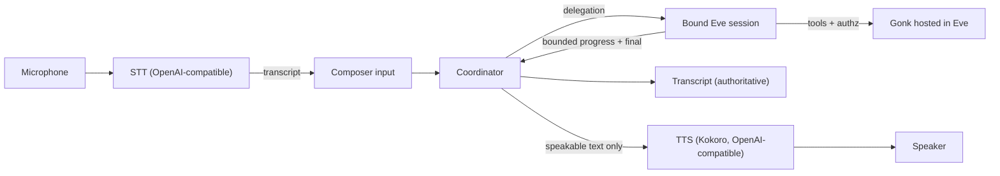

# Coordinator and Half-Duplex Voice

> Date: 2026-07-24
> Status: Draft product and architecture contract
> Product owner: Sigil Chat
> Runtime authority: Eve
> Related:
>
> - `REALTIME-VOICE-AND-BACKGROUND-AGENT-SPEC.md` (duplex; blocked upstream)
> - `PRODUCT-NAV-ARCHITECTURE-PROPOSAL.md` (SC.10 — containment lives in the URL)
> - Roadmap S11.2 (voice in and out), SC.11 (home composition)

## Decision

Build the **coordinator** — a conversational surface that decides what is chat
and what is real work, delegates the work into the bound Eve session, and
projects bounded progress back — and give it **half-duplex voice**: speech in
(STT), speech out (TTS). Full duplex speech-to-speech is deferred.

This is not a reduced realtime. It is a different interaction model with its
own merits: turn-taking is explicit, the transcript is authoritative, every
utterance is reviewable before it becomes an agent turn, and it runs entirely
on substrate we control.

### Why duplex is deferred (evidence, not preference)

Three independent attempts at subscription-backed duplex all failed upstream
on 2026-07-24, each at a different layer:

1. Hand-rolled WebRTC against `chatgpt.com/backend-api/codex/realtime/calls` —
   403 `Voice session access denied` even with the protocol fully reverse-
   engineered from Codex source (correct `OpenAI-Alpha: quicksilver=v2`, correct
   JSON body, correct session payload).
2. Codex's own app-server (`thread/realtime/start`, `transport: webrtc`) — the
   JSON-RPC call SUCCEEDED and Codex's own client then received the identical 403. So this is not a client-side defect: no implementation on our side can
   fix it.
3. The ChatGPT desktop app does have working voice, but authenticates as a
   first-party attested client. Its audio lives in that app's renderer, so it
   cannot be composed into a web application, local or remote.

Conclusion: the subscription grants duplex voice to OpenAI's own attested
clients, and Sigil Chat cannot become one. Duplex therefore requires either an
API key (per-minute cost) or an upstream entitlement change. **That decision is
not blocked by this spec, and this spec is not blocked by it.**

## Architecture

**The text transcript is authoritative. Speech is a delivery surface.** Every
rule below holds whether the user typed or spoke, and whether the reply was
read or heard. A rule that only holds for one modality is a bug in the rule.

## Voice substrate — Gonk already owns this

**Do not build a voice substrate.** Gonk ships it, published and versioned:

- `@gonk/voice-tts@0.5.0` — `POST {baseURL}/audio/speech`, OpenAI-compatible.
- `@gonk/voice-stt` — `POST {baseURL}/audio/transcriptions`, OpenAI-compatible.
- Plus a `pi-voice` plugin and a `setup-voice` skill in `gonk-skills`.

Sigil Chat consumes these. It does not reimplement them, and it does not add a
third voice path. (`_archive/harness/packages/capabilities/voice-*` is the
older copy of the same contract — read for reference, consume the Gonk one.)

### The portability problem, and the fix

The **contract** is provider-neutral; the **defaults** assume Apple Silicon
(David, 2026-07-24: "it might be too opinionated towards my M5 mac"). Verified
in `gonk-extensions/packages/capabilities/*/src/config.ts`:

| Setting             | Default                                       | Portable?                    |
| ------------------- | --------------------------------------------- | ---------------------------- |
| `voice.tts.baseURL` | `http://localhost:1243/v1` (oMLX)             | Mac-only server              |
| `voice.tts.model`   | `mlx-community/Qwen3-TTS-12Hz-1.7B-Base-8bit` | **MLX — Apple Silicon only** |
| `voice.stt.baseURL` | `http://localhost:10650/v1` (mlx-audio)       | Mac-only server              |
| `voice.stt.model`   | `whisper-1`                                   | portable                     |

Every one of these is read through `scope.get(...)`, so all four are
overridable per deployment. **Nothing in the contract is Mac-bound; only the
defaults are.** The fix is configuration, not code.

### Required deployment matrix

Both of these must work, and the difference must be config only:

1. **Local on the server.** Kokoro runs behind an OpenAI-compatible HTTP
   server (kokoro-fastapi or equivalent) in the deployment itself. Kokoro is
   small enough to serve on ordinary server hardware (David, 2026-07-24) and
   has CPU/ONNX builds, so it does not require Apple Silicon or a GPU. This is
   the default for a Linux deployment; MLX defaults must NOT leak into it.
2. **Remote OpenAI-compatible endpoint.** Point `baseURL` at any compatible
   service — hosted OpenAI, a shared internal box, or David's Mac during
   development — with no code change.

Acceptance for this section: a single documented settings change switches
between (1) and (2), and **no MLX/Apple-specific default is reachable in a
Linux deployment** — asserted by a test that resolves voice config under a
server profile and fails if an `mlx-*` model or a Mac-only default port
survives.

Browser-native `SpeechRecognition` is an acceptable STT fallback only where
quality suffices, and must sit behind the same interface.

Server-side synthesis routes through a Gonk tool so receipts and policy apply.

Latency budgets (from S11.2, retained): streaming STT partials < 500 ms;
TTS time-to-first-audio < 2 s for short replies, via chunked generation.

## Security — carried forward unchanged

These are owner decisions from the duplex spec and they bind here identically.
Half-duplex does not soften them; a coordinator is still a model emitting text.

1. **No approval is ever granted from coordinator output.** The coordinator may
   announce that an approval is needed; it may never carry the grant. Grants
   arrive either on another authenticated channel, or from authority delegated
   in advance. Speech recognition adds a second failure mode — a
   mis-transcription, or someone else in the room — but the rule is structural,
   not acoustic: **no approval decision is ever derived from model output.**
2. **Authority may be delegated explicitly, narrowly, revocably** — "you can
   approve image generation requests" — as a `ScopeGrant` with the coordinator
   as a distinct principal. Enumerable, visible while live, and every
   auto-approved action records its granting grant id. Precondition shipped in
   `73c213d` (action-scoped authorization actually enforced).
3. **Never speak what must not leak.** Tool arguments, tool results, reasoning
   traces, hidden prompts, credentials, and authorization receipts are never
   synthesized. Only user-facing progress and final answers reach TTS.

## User experience

**Speech in.** The reserved trailing microphone control in the composer
dictates into the input. States: `idle`, `requesting-microphone`, `listening`,
`transcribing`, `error`. Partial transcript streams into the input as it
arrives. The user can always edit before sending — dictation produces a draft,
not a commitment. A voice-first mode where a completed utterance sends
automatically is opt-in, never the default.

**Speech out.** Per-message play on any agent reply, plus a session-level
"speak replies" preference. Voice is a persona attribute: the persona's voice
is what you hear.

**Audio focus.** Starting STT pauses TTS playback. The two never talk over each
other. Playback is always interruptible.

**Orientation.** SC.10 made containment authoritative in the URL, so a live
voice session must show **which thread it is bound to** from any route, with
one action to return there. Opening a different session while live either
rebinds explicitly with confirmation, or states plainly that it did not. It
must never rebind silently.

**Visible and reversible.** No always-listening mode. Activation is explicit,
its live state is legible, and stopping is always one action away.

Every colour, shadow, badge, and motion choice must survive the
`ux-design-language` one-sentence justification test.

## Delivery slices

### Slice 1 — coordinator core (no audio)

Delegation, idempotency, turn queueing with a bound and oldest-drop, steering
via the supported `cancel({ turnId })` + `deliver()` path (eve ≥ 0.27.4), and
bounded progress projection. Falsifiable entirely in text.

### Slice 2 — authority and approvals

Coordinator as a distinct principal; out-of-band approval; delegated authority
via narrow scope grants. Falsified by proving that no coordinator utterance,
however explicit, can produce a grant.

### Slice 3 — speech out (TTS)

Kokoro behind the OpenAI-compatible contract. Per-message play, speak-replies
preference, chunked generation for time-to-first-audio, and the leak-exclusion
rules enforced by test.

### Slice 4 — speech in (STT)

Mic capture, streaming partials into the composer, editable draft, audio focus,
and full media cleanup on stop/error/unmount.

### Slice 5 — hardening

Retention receipts, redaction, rate limits, mobile behaviour, and a full
voice-only exchange under `browser:owner` review.

## Acceptance criteria

Modality-independent (must hold for typed AND spoken):

- [ ] A delegation enters the bound Eve session with its verified principal,
      persona, resource scope, and approval behaviour.
- [ ] The coordinator cannot invoke Gonk or application tools directly.
- [ ] Eve continues working while the coordinator stays responsive.
- [ ] Busy-turn delegations queue to a stated cap; overflow drops the oldest
      and says so.
- [ ] Steering cancels only the observed `turnId` and delivers its replacement
      without losing session context.
- [ ] **No coordinator output can grant an approval or mint authority** —
      falsified directly with maximally explicit approval text.
- [ ] Delegated authority is narrow, revocable, enumerable, and attributable to
      a grant id on every auto-approved action.

Voice:

- [ ] Dictation streams partials into the composer and leaves an editable draft.
- [ ] Agent replies are playable per-message and via a session preference.
- [ ] Starting STT pauses TTS; playback is interruptible.
- [ ] Tool arguments, tool results, reasoning, and credentials are never
      synthesized — asserted by feeding each and confirming exclusion.
- [ ] Media tracks stop and audio contexts close on stop/error/unmount; no
      orphaned microphone capture.
- [ ] A live session shows which thread it is bound to from every route.
- [ ] `browser:owner` — one full voice-only exchange.

## Explicitly deferred to duplex

Barge-in over the agent mid-sentence, continuous listening, speech-to-speech
without a transcript round-trip, and the sideband event dialect. All of it is
recorded in the realtime spec and none of it blocks this work.
