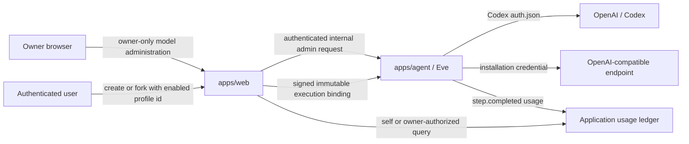

# Model administration and per-user usage metering

> Date: 2026-07-22
> Status: Draft active product and architecture contract
> Owner: Sigil Chat application composition
> Depends on: Eve 0.27 or newer, authenticated principal-bound agent threads,
> and the existing `owner` / `member` application roles
> Related: [`AUTH-AND-USER-SETTINGS-SPEC.md`](AUTH-AND-USER-SETTINGS-SPEC.md),
> [`DEPLOYMENT-INVITE-DEMO-SPEC.md`](DEPLOYMENT-INVITE-DEMO-SPEC.md),
> [`AGENT-MULTI-SESSION-SPEC.md`](AGENT-MULTI-SESSION-SPEC.md), and
> [`APPLICATION-STORAGE-CONSOLIDATION-SPEC.md`](APPLICATION-STORAGE-CONSOLIDATION-SPEC.md)

## Decision

Sigil Chat will provide owner-managed model access as a product capability.
The owner can configure installation-funded providers and models, remotely
manage the installation's Codex/OpenAI login, choose the installation default,
and inspect model usage attributed to each authenticated user.

The first release supports:

- the effective Codex credential home (`CODEX_HOME`, otherwise `~/.codex`),
  including ChatGPT subscription login, headless device login, and OpenAI API
  key login through Codex's supported `auth.json` contract;
- one or more OpenAI-compatible providers, including a LiteLLM proxy in front
  of Bedrock or other upstream providers;
- owner-approved model profiles over those providers;
- user selection among enabled model profiles when creating or forking an
  agent thread; and
- append-only per-user usage metering without quotas, blocking, chargeback, or
  billing enforcement.

Personal user BYOK credentials and native Anthropic transport are deliberate
follow-ups. The data model must not prevent them, but the first release must not
ship placeholder BYOK controls, user-owned secret storage, or unused quota
machinery.

## Product center

This is not a generic preferences feature. It is an installation control plane
over three distinct concerns:

1. **Provider configuration** says where and how a model request runs.
2. **Credential state** says which installation-owned authority pays for and
   authenticates that request.
3. **Usage accounting** says which authenticated Sigil user caused the model
   work and what the provider reported consuming.

Those concerns may be displayed together, but they must remain separate in the
runtime and persisted contracts. A model choice never grants provider
authority, a credential never identifies the Sigil user, and a usage row never
becomes an authorization decision.

## Goals

- Make a remote installation operable without SSH for ordinary model login,
  provider configuration, model enablement, and usage inspection.
- Preserve the zero-configuration local workflow: an unset `CODEX_HOME`
  continues to use the operator's existing `~/.codex/auth.json`.
- Treat Codex subscription auth and OpenAI API-key auth as two modes of the
  same Codex-managed credential source rather than two unrelated integrations.
- Support arbitrary owner-approved OpenAI-compatible endpoints without
  hard-coding LiteLLM, Bedrock, OpenRouter, or another gateway into the domain
  model.
- Attribute every provider-reported model step to the authenticated principal
  and immutable thread execution binding that caused it.
- Keep usage observational. Metering failure must be visible and recoverable,
  but it must not masquerade as a zero-usage period or introduce an unrequested
  spending limit.

## Non-goals

- Per-user BYOK credentials.
- Quotas, rate limits, monthly allowances, prepaid balances, or request denial
  based on usage.
- Invoicing, payment collection, tax handling, or billing-grade chargeback.
- A Sigil-owned replacement for LiteLLM's virtual-key, routing, budget, or
  upstream cost-accounting features.
- Native Anthropic Messages API support. The provider boundary reserves an
  adapter kind for it later; v1 reaches Claude only through an enabled
  OpenAI-compatible gateway.
- Allowing members, model output, agent tools, or browser-supplied thread
  headers to create providers, change endpoint URLs, or select an unapproved
  model id.
- Uploading, downloading, displaying, backing up, or synchronizing raw
  `auth.json` files through the application.
- Moving model credentials into the existing user-settings registry. That
  registry correctly forbids secrets and authorization-bearing values.

The human-authentication spec's earlier deferral of "billing" and "API keys"
refers to human account and product-access features. It does not prohibit this
installation-owned model credential and observational usage contract.

## Terminology

| Term                 | Meaning                                                                                                       |
| -------------------- | ------------------------------------------------------------------------------------------------------------- |
| Provider             | An owner-configured model transport and endpoint policy                                                       |
| Credential source    | Installation-owned authentication material resolved by Eve at request time                                    |
| Model profile        | An owner-approved provider + model id + execution metadata revision                                           |
| Installation default | The enabled model profile used when creating a thread without an explicit permitted selection                 |
| Execution binding    | Server-authored immutable thread record containing the principal, persona, scopes, and model-profile revision |
| Usage event          | One provider-reported model step attributed to a principal and execution binding                              |
| Usage aggregate      | A derived projection over immutable usage events; never the source record                                     |

## Current state and required changes

Today:

- `fixtures/application/sigil-chat.yaml` supplies one checked-in model slug;
- Eve calls `experimental_chatgpt(model)` with that static slug;
- new agent threads already bind an authenticated principal, persona, and
  authorized scopes immutably;
- the owner-only `/status` surface reports model usage as unavailable; and
- product event retention intentionally removes usage details from retained
  `step.completed` events.

Eve 0.27 supplies the enabling runtime seam: a dynamic model can resolve at
session, turn, or step scope, and a step resolver may return a live AI SDK
`LanguageModel`. Sigil will bind one model-profile revision per thread and
resolve the corresponding live model at `step.started`. The selected profile
does not change between steps; provider/model instances should be cached by
profile revision so ordinary tool loops do not manufacture apparent model
switches.

Usage must be recorded before the existing product-retention projection drops
the raw usage fields. The usage ledger is a separate application record, not a
reason to retain an unbounded Eve event stream in the browser-facing thread
snapshot.

## Architecture



### Ownership split

`apps/web` owns:

- the owner-only administration UI;
- member-visible enabled model-profile projections;
- server-side owner checks before any administration request;
- thread creation/forking and immutable model-profile binding;
- usage queries and aggregates authorized for the current viewer; and
- redacted forwarding of credential-management commands to Eve.

App-owned code under `apps/agent` owns:

- resolving the effective `CODEX_HOME` and reporting secret-free Codex auth
  state;
- launching constrained Codex login/logout operations as the Eve runtime user;
- the encrypted installation credential vault for OpenAI-compatible providers;
- provider adapter construction and live credential resolution;
- required model-profile resolution before a model call; and
- durable, idempotent usage-event emission.

Eve owns model execution, lifecycle events, streaming, and dynamic model
resolution. Gonk owns neither model credentials nor provider administration.
No model-administration Gonk tool is registered in v1.

The application database owns provider metadata, revisioned model profiles,
usage events, and aggregates. Raw credentials are not ordinary application
records and are excluded from application backups.

## Persisted contracts

The exact storage adapter may follow the application-storage consolidation
work, but the logical records are fixed by this contract.

### Provider record

```ts
type ModelProviderKind = "codex-auth-json" | "openai-compatible";

interface ModelProviderRecord {
  id: string;
  kind: ModelProviderKind;
  displayName: string;
  baseUrl?: string;
  enabled: boolean;
  credentialRef: string;
  createdAt: string;
  createdByPrincipalId: string;
  updatedAt: string;
  updatedByPrincipalId: string;
  revision: number;
}
```

V1 has one `codex-auth-json` provider because Eve has one effective Codex home.
It may have multiple OpenAI-compatible providers. `credentialRef` is opaque and
never contains a key, token, path supplied by the browser, or serialized
credential. For the Codex provider it denotes the effective Codex credential
source; for an OpenAI-compatible provider it denotes an Eve-vault record.

Members receive only `id`, `displayName`, `enabled`, and the enabled model
profiles they may select. Endpoint URLs, credential state, filesystem paths,
and diagnostic detail are owner-only projections.

### Model-profile revision

```ts
interface ModelProfileRevision {
  id: string;
  revision: number;
  providerId: string;
  modelId: string;
  displayName: string;
  contextWindowTokens?: number;
  enabled: boolean;
  isInstallationDefault: boolean;
  pricing?: {
    inputMicrousdPerMillionTokens?: number;
    outputMicrousdPerMillionTokens?: number;
    cacheReadMicrousdPerMillionTokens?: number;
  };
  createdAt: string;
  createdByPrincipalId: string;
}
```

Editing execution-relevant fields creates a new immutable revision. Existing
threads retain their bound revision; disabling a profile or provider is live
policy and prevents its next call. Revocation wins over historical binding.
Display-only labels may be projected from the latest metadata without changing
execution identity.

Exactly one enabled profile is the installation default. Changing the default
affects newly created threads only.

### Thread execution binding

The existing immutable execution binding gains:

```ts
interface BoundModelProfile {
  profileId: string;
  profileRevision: number;
  providerId: string;
  modelId: string;
}

interface AgentThreadExecutionBinding {
  // existing principal/persona/scope fields
  model: BoundModelProfile;
}
```

The server derives this record after verifying that the profile is enabled and
selectable. The browser may request a profile id but never supplies the bound
provider, model id, revision, credential reference, or principal.

V1 does not mutate a live thread's model binding. Choosing a different model
from an existing conversation creates a fork whose new immutable binding uses
the selected profile. This preserves execution provenance and avoids accidental
full-context re-ingestion under a different provider.

### Usage event

```ts
type UsageCostBasis = "provider-reported" | "profile-estimate" | "unavailable";
type UsageCredentialMode =
  "codex-chatgpt" | "codex-api-key" | "installation-key" | "none";

interface ModelUsageEvent {
  id: string;
  occurredAt: string;
  principalId: string | null;
  threadId: string | null;
  eveSessionId: string;
  turnId: string;
  stepIndex: number;
  sequence: number;
  rootSessionId?: string;
  parentSessionId?: string;
  providerId: string;
  modelProfileId: string;
  modelProfileRevision: number;
  modelId: string;
  credentialMode: UsageCredentialMode;
  inputTokens: number | null;
  outputTokens: number | null;
  cacheReadTokens: number | null;
  cacheWriteTokens: number | null;
  costMicrousd: number | null;
  costBasis: UsageCostBasis;
  providerGenerationId?: string;
}
```

Integers use non-negative validation. Dollar values are stored as integer
micro-USD, never floating point. Unknown fields remain `null`; absent provider
usage is not rewritten to zero.

`id` is deterministic over the durable Eve execution identity so replaying a
step cannot double-charge the ledger. Corrections append adjustment records or
recompute aggregates; raw usage events are not edited in place.

## Provider adapters

### Codex / OpenAI through `auth.json`

The Codex provider uses Codex's standard credential resolution:

1. honor an explicitly configured `CODEX_HOME`;
2. otherwise use `~/.codex`; and
3. read and write the resulting `auth.json` only through supported Codex/Eve
   credential contracts.

Sigil does not add `SIGIL_CODEX_HOME`, copy credentials between homes, or force
a Sigil-owned directory. Local development therefore continues to reuse the
operator's existing Codex login. Remote deployments set `CODEX_HOME` to a
dedicated persistent Eve-only volume.

The admin surface exposes these actions:

- **Sign in with ChatGPT** for an environment with a usable browser callback;
- **Sign in with device code** by running `codex login --device-auth` inside
  Eve and privately returning only the supported verification URI, one-time
  code, status, and expiry to the initiating owner;
- **Use OpenAI API key** by passing the submitted key over stdin to
  `codex login --with-api-key`; and
- **Sign out** through the supported Codex logout command.

The key never appears in argv, environment interpolation, logs, events, or an
application record. The browser clears the field after submission. A remote
device-code challenge is visible only to the initiating owner and is not added
to the agent transcript.

Eve 0.27's Codex transport already distinguishes `auth_mode: "api-key"` from
ChatGPT token credentials. API-key mode stays on OpenAI's Responses endpoint;
ChatGPT mode uses the subscription-backed Codex endpoint and refreshes its
tokens. Sigil reports the detected mode but does not parse or expose the raw
credential fields.

When the effective home is the operator's default `~/.codex`, the UI must warn
before login or logout that the action changes the same credential used by the
operator's Codex CLI. When `CODEX_HOME` points at a dedicated deployment
volume, the UI labels it installation-managed.

### OpenAI-compatible

An OpenAI-compatible provider supplies:

- an owner-authored display name;
- one normalized HTTP(S) base URL;
- an installation-owned bearer credential, where required;
- explicitly enabled model ids; and
- optional capability, context-window, and pricing metadata per model profile.

The adapter uses the AI SDK OpenAI-compatible provider contract. `/models`
discovery is optional assistance, not a prerequisite: gateways may omit,
filter, or rename that endpoint, so owners can enter an exact model id.

LiteLLM is a first-class proving fixture, not a hard-coded provider kind. A
LiteLLM endpoint may route an enabled model to Bedrock, Anthropic, OpenAI, or
another upstream without Sigil learning the upstream credential. If LiteLLM
provides authoritative request cost, Sigil records it as provider-reported;
otherwise Sigil records tokens and either a profile estimate or unavailable
cost.

Provider URLs are owner-only installation policy. Members cannot submit them.
The resolver accepts only HTTP(S), rejects embedded credentials, file and Unix
schemes, cloud metadata and link-local destinations, and unsafe redirect
targets. Private service names such as an internal LiteLLM container remain
possible through explicit deployment policy rather than a broad SSRF bypass.

### Future native providers

Native Anthropic support adds an adapter kind and provider-specific model
options. It does not change model profiles, execution bindings, usage
attribution, or owner/member authorization. V1 must not flatten the provider
contract into OpenAI-specific field names that make this extension a migration.

## Installation credential vault

OpenAI-compatible secrets are installation-owned and stored by app-owned Eve
code. They are encrypted at rest with an authenticated cipher and a
deployment-supplied key-encryption secret that is not stored in the application
database or its backups. Local development may generate a disposable vault key
under the worktree's existing `.data/dev` preparation flow; production must
mount stable secret material.

The vault stores ciphertext, nonce, algorithm/key version, creation time,
rotation time, and provider-bound authenticated metadata. It never stores a
plaintext recovery copy. The UI shows only configured/missing state and a
non-sensitive fingerprint such as the last four characters when the provider
format safely permits it.

Provider-key replacement is atomic: validate and encrypt the new key, swap the
credential reference, then make the old ciphertext unreachable. Revocation at
the upstream provider remains the owner's responsibility and is part of the
rotation proof.

Raw model credentials may transit the authenticated owner request into Web and
the private Web-to-Eve administration call, but Web must neither persist nor
log them. Only Eve has at-rest credential access. Browser, React Query cache,
Gonk, tools, sandboxes, application backups, and usage records never receive
them.

## Administration surface

The existing authenticated settings experience gains owner-only sections:

- **Model access** — provider status, credential actions, endpoint management,
  model profiles, default selection, enable/disable, and explicit test action;
- **Usage** — installation total, daily trend, and per-user/provider/model
  breakdown; and
- a link to the existing owner **System status** surface for runtime health.

These are administration records, not user preferences. Hiding the sections
from members is presentation only; every loader, query, mutation, internal Eve
route, and streaming login operation independently requires the verified
`owner` role.

Members see enabled model profiles in thread creation and fork controls. They
may view their own usage aggregates. They cannot view other users, endpoint
URLs, credential mode, credential fingerprints, provider diagnostics, or
installation-wide cost.

The owner usage view includes:

- requests/model steps;
- input, output, cache-read, and cache-write tokens when reported;
- provider-reported or estimated cost with its basis visibly labelled;
- grouping by UTC day, user, provider, and model; and
- an explicit metering-health state and last-ingested timestamp.

No progress bar, warning color, allowance, or “remaining” language appears in
v1 because no limit exists.

## Runtime model resolution

1. Web verifies the human session and resolves an enabled profile revision.
2. Web creates or forks the thread with a server-authored immutable model
   binding and includes that binding in the signed Eve execution proof.
3. Eve verifies the principal and complete execution proof before session
   creation or continuation.
4. Before every model step, Eve rechecks live provider/profile enablement,
   resolves the installation credential, and returns the cached live model for
   the bound profile revision.
5. Eve executes the step and emits usage with the durable session/turn/step
   identity.
6. The usage ingester writes the idempotent ledger event before browser-facing
   retention removes raw usage details.

An invalid, disabled, missing, or unauthorized bound profile fails before the
provider request. A missing/revoked credential fails the provider call. Neither
case silently falls back to another profile, provider, credential, or billable
account. Eve's required compile-time fallback must be a non-networking,
fail-closed sentinel model. It exists to compile the dynamic agent and to return
an actionable binding error if resolution unexpectedly fails; it never spends
against an installation credential. New product sessions always carry an
explicit binding.

## Usage attribution and cost semantics

The authenticated principal in the immutable execution binding is the billing
subject for product metering. A browser field, model-generated value, tool
argument, workspace selection, display name, or provider account id can never
replace it.

Root and delegated subagent model work remains attributable to the initiating
principal. The ledger preserves root/parent session ids so the UI can show
inclusive totals without losing the execution tree. Compaction and retries are
metered when the provider reports usage.

Health checks, owner “test model” calls, migrations, and other installation
work use a null/system principal and are excluded from per-user totals while
remaining visible in installation totals.

Cost semantics are intentionally honest:

- Codex ChatGPT subscription mode reports requests and tokens, with cost basis
  `unavailable`; Sigil does not invent a dollar value for included plan usage.
- OpenAI API-key and generic compatible modes prefer authoritative
  provider/gateway-reported request cost.
- When authoritative cost is absent and the bound profile revision contains
  pricing, Sigil computes and labels a profile estimate from that immutable
  pricing snapshot.
- When neither exists, cost remains unavailable while token usage remains
  useful.

This ledger is operational metering, not an invoice. Provider dashboards and
invoices remain authoritative for external charges.

## Metering reliability

Usage ingestion is at-least-once from Eve and exactly-once in the logical
ledger through deterministic ids and a unique constraint. Aggregates are
rebuildable projections.

A provider call cannot be made unspent after it completes. Therefore a ledger
write failure does not pretend to have prevented cost. The durable event stays
retryable, metering health becomes degraded, and owner/user views show the gap
window instead of zero. Recovery replays the missing events idempotently.

Usage retention is independent of full transcript retention. Usage rows contain
no prompts, outputs, reasoning text, tool arguments, authorization headers, or
credential material. Deleting a transcript does not silently rewrite usage;
account deletion follows the product's retention/privacy policy and may
pseudonymize the principal while preserving installation totals.

## Security requirements

- Every administration operation requires a fresh verified Better Auth session
  and server-side `owner` role check.
- Eve independently authenticates and authorizes the internal administration
  request; Web's assertion alone is insufficient.
- Device-login jobs are single-owner, single-use operations with bounded
  lifetime. Starting a second job cancels or rejects without mixing challenges.
- Login codes, access tokens, refresh tokens, API keys, `auth.json`, vault
  ciphertext, and authorization headers never enter logs, traces, analytics,
  model context, tool results, Gonk context, or usage records.
- The Web process never mounts `CODEX_HOME` or the Eve credential vault.
- Remote deployments persist `CODEX_HOME` in an Eve-only volume with restrictive
  ownership and file permissions. Local reuse of `~/.codex` remains supported
  and visibly identified.
- Credential and provider mutation is revision-checked and audited with actor,
  provider id, action, time, and outcome, but no secret value.
- Provider test failures return a normalized diagnostic without upstream bodies
  or headers that may contain secrets.
- Disabling a provider/profile or logging out takes effect before the next
  model request. Cached model objects never cache authorization beyond the live
  credential check.
- Cross-user thread access and usage queries fail by exact principal id, not by
  obscured UI state.
- Secret-canary scans cover browser payloads, caches, logs, Eve events,
  application databases, backups, Gonk/tool filesystems, and error responses.

## Failure behavior

| Condition                            | Required behavior                                                             |
| ------------------------------------ | ----------------------------------------------------------------------------- |
| No enabled default                   | Owner surface is actionable; new thread creation fails closed                 |
| Selected profile disabled or deleted | Deny before provider request; offer enabled profiles                          |
| Credential missing or revoked        | Model call fails with normalized repair guidance; no fallback                 |
| `auth.json` missing                  | Codex provider reports disconnected and offers login                          |
| `auth.json` invalid                  | Report invalid state without file contents; require supported relogin         |
| Device login expires/declines        | End the private job, persist no challenge, retain prior valid login           |
| Provider endpoint unreachable        | Preserve configuration, report degraded readiness, record no fabricated usage |
| Usage absent from provider           | Record null fields and `unavailable`, never zeros                             |
| Usage replayed                       | Unique id makes ingestion a no-op                                             |
| Usage ingestion delayed              | Show degraded/gap state and retry from durable events                         |
| Member calls admin API               | `403` before filesystem, vault, provider, or process work                     |
| Admin logs out shared `~/.codex`     | Require explicit warning/confirmation; action affects Codex CLI too           |

## Configuration and bootstrap

`fixtures/application/sigil-chat.yaml` retains `agent.model`, but its role
changes from permanent runtime selection to checked-in bootstrap policy:

- a fresh installation creates the Codex provider plus one model profile from
  the fixture slug;
- that profile becomes the initial installation default;
- subsequent owner-managed provider/profile state lives in the application
  database and survives restart; and
- changing the fixture does not silently rewrite an initialized
  installation's selected provider or existing thread bindings.

`pnpm dev` continues to require no `.env`. With no explicit `CODEX_HOME`, Eve
uses `~/.codex`; development readiness and one-time owner login remain intact.
Worktree reset removes only worktree-owned provider metadata, usage, and
disposable vault state. It never deletes or edits the operator's external
`~/.codex`.

Production may set standard `CODEX_HOME` to a dedicated persistent Eve volume.
The encrypted compatible-provider vault requires one deployment secret outside
the application database. This is a legitimate secret/configuration boundary,
not checked-in YAML product behavior.

## Implementation slices

### Slice 1: runtime and records

1. Land Eve 0.27+ and remove obsolete local Eve patches.
2. Add provider/profile repositories and bootstrap migration.
3. Extend immutable thread execution bindings with a model-profile revision.
4. Replace the static model with required dynamic step resolution and no
   cross-provider fallback.

### Slice 2: owner model access

1. Add owner-only provider/model server functions and UI.
2. Add secret-free Codex auth-state reporting.
3. Add device-code, API-key, status, and logout operations against the effective
   `CODEX_HOME`.
4. Add the Eve-owned compatible-provider vault, endpoint policy, credential
   rotation, and a real LiteLLM-compatible HTTP fixture.

### Slice 3: selection and metering

1. Add model-profile selection to thread creation and fork controls.
2. Persist idempotent usage events for all model steps and delegated work.
3. Add user-self and owner-all usage queries and aggregates.
4. Replace `/status` usage-unavailable output with a metering-health summary and
   link to the detailed owner usage section.

### Slice 4: operations and proof

1. Reconcile the deployment fixture with multiple enabled providers and
   remotely managed Codex login.
2. Prove local `~/.codex` reuse and dedicated remote `CODEX_HOME` independently.
3. Prove restart, credential rotation/revocation, secret isolation, usage replay,
   and two-user attribution.
4. Update the development/configuration guides after the cold-start proof.

## Acceptance criteria

- [ ] A fresh local worktree still reaches authenticated chat through
      `pnpm dev` using the operator's existing `~/.codex` when `CODEX_HOME` is
      unset.
- [ ] A remote owner can complete device-code login without SSH, restart Eve,
      and make another subscription-backed call from the same dedicated
      `CODEX_HOME`.
- [ ] An owner can replace that Codex login with an OpenAI API key through the
      supported stdin login flow; Eve reports the new mode without exposing the
      key and the next call uses the OpenAI API path.
- [ ] An owner can configure a LiteLLM OpenAI-compatible endpoint, store its
      installation credential, enable at least two model ids, choose the
      default, and complete streaming plus tool-call turns.
- [ ] A member can select only enabled profiles. Switching an existing
      conversation creates a fork with a new immutable model binding.
- [ ] Disabling a profile/provider or revoking its credential makes the next
      bound call fail without silently charging another credential.
- [ ] Two authenticated users produce usage rows attributed to their exact
      principal ids across ordinary steps, tool loops, compaction when present,
      and delegated subagent calls.
- [ ] Replaying the same Eve events does not duplicate usage.
- [ ] Owner totals equal the sum of user and system events for the selected
      period; each member can read only their own aggregate.
- [ ] Subscription usage displays tokens/requests with unavailable dollar cost;
      provider-reported and profile-estimated costs remain visibly distinct.
- [ ] A forced usage-store outage produces a visible metering gap, then
      idempotently catches up after recovery; the UI never displays the gap as
      zero usage.
- [ ] Member requests to every provider, credential, login, and all-users usage
      endpoint fail before filesystem, process, vault, or network work.
- [ ] Seeded secret-canary scans find no model credential in browser caches,
      logs, application records, backups, Eve events, Gonk/tool state, or error
      responses.
- [ ] Development reset never mutates an external `~/.codex`; remote teardown
      names and destroys the dedicated Codex/vault volumes explicitly.
- [ ] Focused tests, affected package tests, lint, typecheck, production build,
      cold local start, and one disposable remote browser proof pass.

## Deferred follow-ups

### Personal BYOK

BYOK later adds a user-owned credential scope, self-only management, explicit
selection between personal and installation funding, and corresponding usage
provenance. A failed personal credential must never fall back to an
installation credential. No v1 record or UI should claim that this exists.

### Limits and budgets

Limits begin only after real usage has been observed and reconciled against
provider records. They will require reservation/reconciliation semantics for
concurrent calls. V1 stores no fake allowance and blocks no request based on
usage.

### Native Anthropic

A future native adapter may use the AI SDK Anthropic provider and
provider-specific options. It reuses provider administration, model-profile
revisioning, thread binding, credentials, and usage accounting.

## References

- [Eve dynamic model configuration](https://github.com/vercel/eve/blob/main/packages/eve/docs/agent-config.md)
- [OpenAI Codex authentication](https://learn.chatgpt.com/docs/auth)
- [AI SDK OpenAI-compatible providers](https://ai-sdk.dev/providers/openai-compatible-providers)
- [LiteLLM proxy and spend tracking](https://docs.litellm.ai/)
