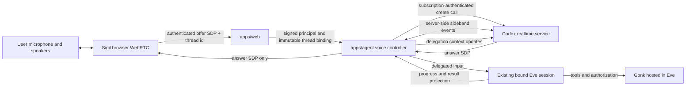

# Realtime Voice and Background Agent

> Date: 2026-07-24
> Status: Draft product and architecture contract
> Product owner: Sigil Chat
> Runtime authority: Eve
> Related:
>
> - `EVE-AS-GONK-HOST-SPEC.md`
> - `MODEL-ADMINISTRATION-AND-USAGE-SPEC.md`
> - `AGENT-MULTI-SESSION-SPEC.md`
> - `AGENT-SURFACE-COORDINATION-SPEC.md`
> - `PRODUCT-NAV-ARCHITECTURE-PROPOSAL.md`
> - Gonk `docs/pi-realtime-voice-extension-spec.md`

## Decision

Sigil Chat will support a live speech-to-speech conversation attached to the
currently selected application thread.

The realtime voice model is the conversational front end. Eve remains the
agent. When the voice model decides that work belongs with the agent, it emits
a delegation event; Sigil Chat routes that event into the existing,
authenticated Eve session. Eve performs the work with the same persona,
context, tools, Gonk authorization, approvals, persistence, and output
projection as a typed message.

This is not a second agent runtime and does not embed Codex app-server into
Sigil Chat.

## User experience

The reserved trailing microphone position in the composer becomes a live-voice
control.

Starting voice:

1. asks for microphone permission when necessary;
2. connects the call to the active application thread;
3. changes the microphone control into a compact live-state control;
4. allows the user to continue navigating the application while speaking; and
5. leaves Eve work visible in the existing agent HUD, transcript, ambient
   panels, and work surfaces.

The user can:

- converse naturally without turning every utterance into an agent turn;
- ask the voice model to hand work to the agent;
- continue talking while Eve works in the background;
- hear concise progress and the final result;
- interrupt voice playback;
- stop the active Eve turn through the existing explicit stop action;
- end voice without ending or discarding the application thread; and
- continue the same thread in text.

Voice is globally attached to the active application thread, not to the
currently visible route. Route changes must not create another call or another
Eve session.

## Goals

- Use the user's existing Codex/ChatGPT subscription login held by
  `apps/agent`.
- Keep OAuth credentials and the upstream call identifier out of the browser.
- Use browser WebRTC for microphone capture and audio playback.
- Route delegated work into the exact Eve session bound to the active Sigil
  Chat thread.
- Preserve the existing principal, persona, resource-scope, approval, tool, and
  retention boundaries.
- Stream useful Eve progress and completion text back into the voice
  conversation.
- Isolate the experimental subscription-backed provider behind a replaceable
  adapter.

## Non-goals

- Giving the realtime model direct access to application or Gonk tools.
- Treating the realtime model as an independent durable persona.
- Running a parallel Codex thread or app-server session.
- Sending the Codex OAuth token, account id, or sideband credentials to the
  browser.
- Making the raw realtime event stream part of the durable Eve transcript.
- Exact preservation of every spoken filler, interruption, or partial
  transcription.
- Replacing the existing `@gonk/pi-voice` STT/TTS provider model.
- API-key billing fallback without an explicit later product decision.

## Architecture



### Ownership

`apps/web` owns:

- microphone permission and browser media lifecycle;
- `RTCPeerConnection`, the input audio track, remote audio playback, and the
  `oai-events` data channel;
- the live/muted/connecting/error UI;
- authenticating the application user;
- selecting the active thread; and
- obtaining a signed immutable thread/session binding before call creation.

`apps/agent` owns:

- resolving subscription credentials through the same standard Codex login
  authority used by model execution;
- refreshing credentials through a supported provider seam;
- creating and closing the upstream realtime call;
- retaining the upstream call id server-side;
- opening and parsing the server-side sideband connection;
- correlating one call with one verified Sigil principal, thread, persona, and
  Eve session binding;
- routing delegation into Eve; and
- projecting bounded Eve progress and completion text back to realtime.

Eve owns:

- the durable agent session;
- model execution;
- lifecycle events and streaming;
- turn interruption;
- application-tool hosting; and
- the agent output that becomes durable product state.

Gonk owns:

- tool definitions and schemas;
- capability discovery;
- authorization and approval requirements;
- invocation receipts;
- memory, knowledge, skills, and scope behavior hosted by Eve.

The realtime provider owns only the ephemeral voice conversation. It receives
no ambient application authority.

## Subscription-backed provider boundary

The first provider is the subscription-backed call path currently used by
Codex:

```text
POST https://chatgpt.com/backend-api/codex/realtime/calls
  ?intent=quicksilver
  &architecture=avas
Authorization: Bearer <refreshed Codex OAuth token>
ChatGPT-Account-Id: <account id>
```

The request contains the browser's offer SDP and a realtime session
configuration with client delegation enabled. The response body contains the
answer SDP. Its `Location` header contains the call id used for the server-side
sideband connection.

This endpoint and the QuickSilver/AVAS event dialect are experimental,
subscription-product interfaces rather than the public API-key Realtime
contract. They must be isolated behind:

```ts
interface RealtimeVoiceProvider {
  createCall(input: {
    offerSdp: string;
    session: RealtimeVoiceSessionConfig;
    credentials: ResolvedSubscriptionCredentials;
    signal: AbortSignal;
  }): Promise<{
    answerSdp: string;
    callId: string;
  }>;

  connectSideband(input: {
    callId: string;
    credentials: ResolvedSubscriptionCredentials;
    signal: AbortSignal;
  }): Promise<RealtimeVoiceSideband>;
}
```

Neither Sigil browser code nor product-domain code may construct the upstream
URL, auth headers, or provider-specific event envelopes.

Request-shape compatibility is not proof that OpenAI supports this client or
that the user's subscription is entitled to the feature. A live call plus an
upstream-supported credential/transport seam is a release gate. If that gate
cannot be met, the subscription provider remains disabled; Sigil Chat must not
work around product attestation or entitlement checks.

`apps/agent` must not deep-import Eve's private auth implementation. Eve should
expose either:

1. a supported subscription-authenticated transport/credential resolver usable
   for non-Responses Codex endpoints; or
2. a first-class realtime provider that accepts the offer SDP and returns the
   answer plus a sideband event surface.

Until one of those exists, implementation is blocked at the credential-refresh
boundary even though a non-refreshing local proof can be built.

## Call creation contract

The browser creates its media objects before generating the offer:

```ts
const peer = new RTCPeerConnection();
const stream = await navigator.mediaDevices.getUserMedia({ audio: true });
peer.addTrack(stream.getAudioTracks()[0], stream);
peer.createDataChannel("oai-events");
const offer = await peer.createOffer();
await peer.setLocalDescription(offer);
```

The browser sends only:

```ts
interface StartRealtimeVoiceInput {
  threadId: string;
  offerSdp: string;
  clientRequestId: string;
}
```

The server returns:

```ts
interface StartRealtimeVoiceResult {
  callHandle: string;
  answerSdp: string;
  expiresAt?: string;
}
```

`callHandle` is an opaque, short-lived application identifier. It is not the
upstream call id.

Before upstream network or credential access, the server must verify:

- the application session;
- access to `threadId`;
- the signed Eve session binding;
- that the bound principal and persona match the selected thread;
- that no other live voice call owns that thread; and
- offer size and request-rate limits.

Credential and upstream network I/O happen only after these checks.

## Delegation contract

Provider-specific handoff events normalize to:

```ts
interface RealtimeDelegation {
  id: string;
  input: string;
  transcriptDelta?: string;
  createdAt: string;
}
```

The agent input preserves provenance:

```xml
<realtime_delegation>
  <input>...</input>
  <transcript_delta>...</transcript_delta>
</realtime_delegation>
```

The wrapper is model context, not authorization. The verified server-side
thread binding remains authoritative.

Delegations are idempotent by `(callHandle, delegation.id)`.

### Turn concurrency

Sigil Chat currently permits one active Eve turn per application thread.

- If Eve is idle, dispatch the delegation immediately.
- If Eve is busy, retain at most one ordered pending delegation queue for that
  call and dispatch it as follow-up work when the current turn settles.
- A repeated or superseding voice request may coalesce only when the realtime
  provider explicitly marks it as replacing the earlier request.
- Spoken cancellation must never be inferred from arbitrary transcript text.
  The realtime provider may request cancellation, but the application presents
  or executes it through Eve's explicit interruption contract.
- Adding true mid-turn steering requires a supported Eve steering API and is a
  later capability. It must not be approximated by concurrent `send()` calls.

The voice model may acknowledge queued work immediately: “I’ve passed that to
the agent; it will pick it up after the current step.”

## Projecting agent output back to voice

The voice controller subscribes to the same Eve lifecycle stream that backs the
product projection. It sends only bounded, user-meaningful text:

- a short accepted/queued acknowledgement;
- phase changes worth hearing;
- approval-needed state;
- recoverable failure state; and
- the final user-facing answer.

Token deltas may be streamed for the active final answer when the provider
supports delegation-context append. Tool arguments, tool results, reasoning,
credentials, hidden prompts, and authorization receipts are never mirrored.

Backpressure is mandatory:

- coalesce rapid progress updates;
- cap each spoken progress message;
- never enqueue stale progress behind a completed result;
- prefer the final answer over intermediate narration; and
- stop outbound speech when the call closes.

The text transcript and application projections remain authoritative. Spoken
output is a delivery surface.

## Lifecycle and state

Application call states:

```ts
type RealtimeVoiceState =
  | "idle"
  | "requesting-microphone"
  | "connecting"
  | "live"
  | "reconnecting"
  | "closing"
  | "closed"
  | "error";
```

One live call may be attached to a thread. A browser refresh does not silently
resume microphone capture. If the server still holds the old call, the new
client closes it before creating another.

The server closes the upstream call when:

- the user ends voice;
- the authenticated browser session expires;
- the thread binding is revoked or changes;
- the sideband cannot recover within its bounded retry policy;
- the peer connection remains disconnected beyond the grace period; or
- the application shuts down.

All timers and sockets must be abortable and must not keep a development
process alive after shutdown.

## Persistence and retention

Persist:

- the accepted user delegation as part of the normal Eve turn;
- the normal Eve output and product projections;
- a bounded receipt containing call handle, thread id, start/end times,
  provider kind, terminal reason, and delegation ids; and
- explicit user-visible errors.

Do not persist:

- raw microphone audio;
- remote audio;
- partial recognition hypotheses;
- access tokens, account ids, upstream call ids, SDP, ICE candidates, or
  sideband frames;
- voice-model hidden state; or
- duplicate raw realtime transcripts.

If the product later offers a voice transcript, it must be an explicit,
sanitized projection with retention rules compatible with
`AGENT-SESSION-RETENTION-ISSUE.md`.

## Security and privacy

- Browser clients never receive subscription credentials.
- The call-create route is authenticated and CSRF-protected.
- The offer SDP is sensitive ephemeral connection material: redact it from
  logs and traces.
- The call handle is scoped to the authenticated user and thread.
- Sideband events are untrusted provider input and require schema validation,
  size limits, and unknown-event tolerance.
- Delegation text cannot choose a principal, persona, resource scope, approval
  mode, or tool policy.
- Gonk authorization is re-evaluated normally for every tool discovery and
  invocation.
- Voice activation is visible and reversible. There is no ambient or
  always-listening mode in this specification.

## Failure behavior

- Missing/expired Codex login: report that the owner must restore Codex model
  access; do not request an API key.
- Unsupported subscription realtime entitlement: disable live voice without
  disabling text/Eve operation.
- Call creation failure: close local media tracks and return to idle.
- Sideband failure with working media: tell the user agent delegation is
  unavailable, then close unless recovery succeeds within the bounded retry.
- Eve failure: keep the voice call alive when safe and report the agent error.
- Browser media loss: close the application call and server sideband.
- Unknown provider event: record a redacted diagnostic and continue.

## Delivery slices

### Slice 1: provider proof

- Extract or add a supported Eve subscription credential/transport seam.
- Create a hermetic fake-server proof of the call request, auth headers,
  response SDP, `Location` call id, and sideband connection.
- Normalize legacy handoff and current client-delegation events.

### Slice 2: bound Eve bridge

- Add a server-side controller bound to the verified thread/session identity.
- Dispatch idle delegations and queue busy delegations.
- Subscribe to Eve progress/final output.
- Prove cancellation, duplicate suppression, call close, and binding
  revocation.

### Slice 3: browser voice

- Implement the reserved mic control and WebRTC lifecycle.
- Add mute, stop, connecting, permission-denied, degraded-delegation, and error
  states.
- Keep the call mounted across product route changes.

### Slice 4: product projection and hardening

- Mirror bounded progress/final output.
- Add retention receipts and redaction.
- Add rate limits, reconnect bounds, diagnostics, and deployment capability
  probes.
- Run live human acceptance with microphone, interruption, navigation, one
  delegated tool call, one approval, and one background completion.

## Acceptance criteria

- A user authenticated to Sigil Chat can start and end a voice call from the
  reserved microphone control.
- The browser receives no Codex credential, account id, or upstream call id.
- A delegated voice request enters the active thread's existing Eve session
  with its verified principal, persona, resource scope, and approval behavior.
- The realtime model cannot invoke Gonk or application tools directly.
- Eve can continue work while the voice conversation remains responsive.
- Busy-turn delegation is queued without concurrent Eve `send()` calls.
- Useful Eve progress and final output can be heard without leaking hidden
  model or tool payloads.
- Ending voice does not end, fork, or replace the Eve thread.
- Text operation continues normally when realtime voice is unavailable.
- Unit, integration, and browser tests cover auth-before-network ordering,
  binding mismatch, duplicate delegation, busy queueing, interruption, call
  closure, redaction, and media cleanup.
- A live acceptance run proves real microphone input, remote audio,
  subscription billing, delegation into Eve, a Gonk-authorized tool call, and
  spoken completion.

## Open upstream dependency

The supported subscription credential/transport seam is the only hard
cross-repository dependency for the first real call. Sigil Chat must not solve
it by reading and refreshing `CODEX_HOME/auth.json` itself or by importing a
private Eve file path.

## Evidence baseline

This draft is based on:

- OpenAI Codex commit
  [`99744cfe04806ebaa1e5d08e3e790070f852472b`](https://github.com/openai/codex/tree/99744cfe04806ebaa1e5d08e3e790070f852472b);
- Codex's documented
  [`thread/realtime/start` WebRTC flow](https://github.com/openai/codex/blob/99744cfe04806ebaa1e5d08e3e790070f852472b/codex-rs/app-server/README.md#example-start-realtime-with-webrtc);
- Codex's
  [subscription realtime-call request construction](https://github.com/openai/codex/blob/99744cfe04806ebaa1e5d08e3e790070f852472b/codex-rs/codex-api/src/endpoint/realtime_call.rs);
- Codex's
  [handoff-to-agent and agent-to-realtime routing](https://github.com/openai/codex/blob/99744cfe04806ebaa1e5d08e3e790070f852472b/codex-rs/core/src/realtime_conversation.rs);
  and
- OpenAI's public
  [Realtime WebRTC call contract](https://platform.openai.com/docs/api-reference/realtime).

The pinned Codex source is implementation evidence, not a stability promise.
Revalidate it before implementation and on every provider compatibility
upgrade.
