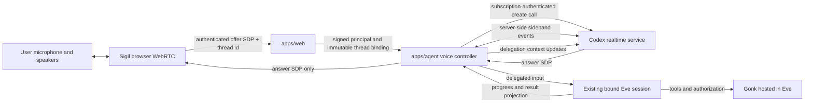

# Coordinator and Background Agent (with Realtime Voice)

> Date: 2026-07-24
> Status: Draft product and architecture contract
> Product owner: Sigil Chat
> Runtime authority: Eve
> Related:
>
> - `EVE-AS-GONK-HOST-SPEC.md`
> - `MODEL-ADMINISTRATION-AND-USAGE-SPEC.md`
> - `AGENT-MULTI-SESSION-SPEC.md`
> - `AGENT-SURFACE-COORDINATION-SPEC.md`
> - `PRODUCT-NAV-ARCHITECTURE-PROPOSAL.md`
> - Gonk `docs/pi-realtime-voice-extension-spec.md`

## Decision

Sigil Chat separates the **conversational surface** from the **agent that does
the work**.

A **coordinator** holds the interaction: it is cheap, fast, and always
responsive. It decides what is chat and what is real work. When work belongs
with the agent it emits a delegation; Sigil Chat routes that into the existing,
authenticated Eve session bound to the active thread. Eve performs the work with
the same persona, context, tools, Gonk authorization, approvals, persistence,
and output projection as a typed message, and keeps working in the background
while the conversation stays live. Bounded progress projects back.

**Realtime speech-to-speech voice is a committed deliverable** — it is the
coordinator transport this product wants. It is sequenced second only because
the coordinator contract is what makes voice safe and testable, and because
voice alone carries a cross-repository credential dependency the coordinator
does not.

The coordinator is not a second agent runtime and holds no ambient authority.
It is a **principal** whose authority is explicitly granted and revocable.

### Coordinator transports

1. **Text coordinator** — buildable today, no upstream dependency. The
   falsification surface for delegation, queueing, steering, approval routing,
   and delegated authority.
2. **Realtime voice** — the target experience. Same coordinator contract, a
   different transport. Blocked only on the credential seam in
   §Subscription-backed provider boundary.

Anything true of the coordinator is true of both. A rule that only holds for
one is a bug in the rule.

### Eve provides the runtime primitives (verified, eve 0.27.5)

This spec previously deferred steering as "a later capability". It is not:

- `session.cancel({ turnId? })` on channel and client sessions — cooperative,
  turn-scoped cancellation; `turnId` limits the request to the turn the caller
  observed, so a stale cancel cannot kill a newer turn. Confirmed by
  `turn.cancelled` then `session.waiting`, **keeping session context**.
- `cancelTurn()` + `deliver()` (follow-up into a parked session) — steering is
  their composition, not a new API.
- `cancel` / `reset` / `resolveActiveSession` on **authored custom channel
  routes**: a coordinator can BE an Eve channel.
- `getEventStream({ startIndex })` over durable streams that reconnect from
  their last cursor — the bounded-progress seam, and it survives disconnects,
  which is what a background agent actually requires.

**The coordinator SHOULD be implemented as an Eve channel** rather than as
bespoke controller code beside one. Eve already routes one agent across many
channels (Slack, Teams, Discord, Telegram, Twilio, GitHub, chat-sdk); that
existing multi-channel routing is what makes out-of-band approval composition
rather than new infrastructure.

## Authority and approvals

Two rules, both owner decisions (David, 2026-07-24). They are the load-bearing
security content of this spec.

### 1. An approval is never granted on the coordinator surface

The coordinator may _announce_ that an approval is needed. It may never carry
the grant. A grant arrives by exactly one of:

- **another channel** — the approval is requested and granted on a different
  authenticated surface (the web UI, a Slack DM, any Eve channel), where the
  human acts deliberately against a real affordance; or
- **authority delegated in advance** — see below.

This generalizes the existing rule that spoken cancellation must never be
inferred from transcript text, and it matters more than cancellation did. A
coordinator is a model emitting text. If saying the right words grants an
approval, then one model authorizes the other model's tool calls and the human
gate is decorative — a confused deputy with a microphone. The rule is
structural: **no approval decision is ever derived from coordinator output**,
however confident, however explicit the user's speech sounded.

### 2. Authority may be delegated explicitly, narrowly, and revocably

The user may grant the coordinator standing authority for a named class of
work — "you can approve image generation requests" — without approving each
instance.

This is not a new mechanism. It is the existing scope-grant system with the
coordinator as a first-class principal:

```ts
ScopeGrant {
  principalId: string        // the coordinator, not the human
  resourceScope: string      // where the authority applies
  actions: ScopeAuthorizationAction[]   // discover | read | write | tool
}
```

Requirements:

- Grants are **narrow** (a named capability class, never "approvals"),
  **revocable**, **enumerable** by the user, and **visible** while live.
- The coordinator's principal is distinct from the human's. It cannot hold
  authority the human does not have, and revoking the human's access revokes
  the coordinator's.
- A delegated approval is recorded with its granting scope-grant id, so every
  auto-approved action is attributable after the fact.
- Absent a matching grant, rule 1 applies with no fallback.

**Precondition, already shipped (73c213d, 2026-07-24):** action-scoped
authorization must actually be enforced before delegated authority is safe.
Until that fix, grants matched on action but every artifact operation asked the
policy for `"read"` — so a grant meaning "you may approve image generation"
would have silently authorized everything. Narrow delegation is only narrow if
the action is real.

## User experience

The reserved trailing microphone position in the composer becomes a live-voice
control.

Starting voice:

1. asks for microphone permission when necessary;
2. connects the call to the active application thread;
3. changes the microphone control into a compact live-state control;
4. allows the user to continue navigating the application while speaking; and
5. leaves Eve work visible in the existing agent HUD, transcript, ambient
   panels, and work surfaces.

The user can:

- converse naturally without turning every utterance into an agent turn;
- ask the voice model to hand work to the agent;
- continue talking while Eve works in the background;
- hear concise progress and the final result;
- interrupt voice playback;
- stop the active Eve turn through the existing explicit stop action;
- end voice without ending or discarding the application thread; and
- continue the same thread in text.

The coordinator is globally attached to the active application thread, not to
the currently visible route. Route changes must not create another call or
another Eve session.

That decoupling creates an orientation hazard, because SC.10 made containment
authoritative in the URL: a user can be speaking into a thread in one project
while looking at another, with nothing on screen saying so. Required:

- a persistent indicator naming the thread the coordinator is bound to,
  visible from every route while a session is live;
- one action to jump back to that thread; and
- opening a different session while live must either rebind explicitly (with
  the user's confirmation) or state plainly that it did not. It must never
  rebind silently — the delegation would land somewhere the user is not
  looking.

## Goals

- Use the user's existing Codex/ChatGPT subscription login held by
  `apps/agent`.
- Keep OAuth credentials and the upstream call identifier out of the browser.
- Use browser WebRTC for microphone capture and audio playback.
- Route delegated work into the exact Eve session bound to the active Sigil
  Chat thread.
- Preserve the existing principal, persona, resource-scope, approval, tool, and
  retention boundaries.
- Stream useful Eve progress and completion text back into the voice
  conversation.
- Isolate the experimental subscription-backed provider behind a replaceable
  adapter.
- Keep every coordinator rule transport-independent, so the text coordinator is
  a real proof of the voice one rather than a rehearsal.

## Non-goals

- Giving the realtime model direct access to application or Gonk tools.
- Treating the realtime model as an independent durable persona.
- Running a parallel Codex thread or app-server session.
- Sending the Codex OAuth token, account id, or sideband credentials to the
  browser.
- Making the raw realtime event stream part of the durable Eve transcript.
- Exact preservation of every spoken filler, interruption, or partial
  transcription.
- Replacing the existing `@gonk/pi-voice` STT/TTS provider model.
- API-key billing fallback without an explicit later product decision.

## Architecture



### Ownership

`apps/web` owns:

- microphone permission and browser media lifecycle;
- `RTCPeerConnection`, the input audio track, remote audio playback, and the
  `oai-events` data channel;
- the live/muted/connecting/error UI;
- authenticating the application user;
- selecting the active thread; and
- obtaining a signed immutable thread/session binding before call creation.

`apps/agent` owns:

- resolving subscription credentials through the same standard Codex login
  authority used by model execution;
- refreshing credentials through a supported provider seam;
- creating and closing the upstream realtime call;
- retaining the upstream call id server-side;
- opening and parsing the server-side sideband connection;
- correlating one call with one verified Sigil principal, thread, persona, and
  Eve session binding;
- routing delegation into Eve; and
- projecting bounded Eve progress and completion text back to realtime.

Eve owns:

- the durable agent session;
- model execution;
- lifecycle events and streaming;
- turn interruption;
- application-tool hosting; and
- the agent output that becomes durable product state.

Gonk owns:

- tool definitions and schemas;
- capability discovery;
- authorization and approval requirements;
- invocation receipts;
- memory, knowledge, skills, and scope behavior hosted by Eve.

The realtime provider owns only the ephemeral voice conversation. It receives
no ambient application authority.

## Wire protocol — measured, not inferred (2026-07-24)

Probed directly against the live endpoint with David's Codex credentials, at
his explicit instruction to bypass the Eve seam. Findings correct this spec in
ways that change what is actually blocked.

**The Eve credential seam was never the blocker.** Reading
`~/.codex/auth.json` and calling the endpoint directly authenticates fine
(`auth_mode: chatgpt`). Building a supported Eve credential/transport seam
would not have moved this forward by one byte. Slice 3 was queued behind the
wrong dependency.

**The body is JSON, not multipart.** This spec documented a multipart form.
For the `/backend-api` host it is `{"sdp": "...", "session": {...}}` as
`application/json`. Codex branches on the URL containing `/backend-api`
(`uses_backend_request_shape()`); multipart is the PUBLIC API shape only.
Sending multipart to the backend host returns `Unsupported content type`.

**`OpenAI-Alpha` is the real gate, and this spec never mentioned it.**
Required header, and its value decides access:

| Header                                    | Result                                               |
| ----------------------------------------- | ---------------------------------------------------- |
| absent                                    | `403 Voice session access denied.`                   |
| `OpenAI-Alpha: v1` / `v2, quicksilver=v1` | `400` — must be `quicksilver=v1` or `quicksilver=v2` |
| `OpenAI-Alpha: quicksilver=v1`            | `403 Voice session access denied.`                   |
| `OpenAI-Alpha: quicksilver=v2`            | **passes the access check**                          |

So `quicksilver=v1` — the dialect this spec was written against — is no longer
granted. `v2` is the live one. A 403 here reads like an entitlement problem and
is not: it is a protocol-version refusal.

**Entitlement is NOT the blocker either.** David ran a Codex voice session on
this account the same day (`~/.codex/realtime-voice-continuity.json`). The
account has voice.

**Validated request, as far as it gets today:**

```
POST https://chatgpt.com/backend-api/codex/realtime/calls
       ?intent=quicksilver&architecture=avas
Authorization: Bearer <tokens.access_token from ~/.codex/auth.json>
ChatGPT-Account-Id: <tokens.account_id>
OpenAI-Alpha: quicksilver=v2
Content-Type: application/json

{"sdp": "<offer SDP>", "session": {"type": "quicksilver"}}
```

`session.type` must be `"quicksilver"` whenever `intent=quicksilver`.

**The one remaining unknown** is the v2 `session` schema. Every object-valued
session returns `Field session.model is not allowed for this Codex realtime
session` — including an empty `{}`, and regardless of an `openai-model` header
— while omitting `session` returns `Field session must be an object`. Something
in the v2 envelope differs from the v1 shape; blind probing did not find it and
was stopped rather than continued.

**How to close it (do this before writing any client code):** run Codex's own
voice session through an intercepting proxy and capture one real request. That
is one observation versus unbounded guessing, and it also yields the sideband
handshake this spec still describes only from the stale pinned source. Other
strings in the shipped binary (`x-session-id`, `x-models-etag`,
`x-reasoning-included`, `originator`, `server_vad`, `near_field`, `audio/pcm`,
`conversation.handoff.append`) suggest the capture will answer several open
questions at once.

**Transport decides the auth — the single most important finding.** From
`codex-rs/core/src/realtime_conversation.rs:800-815` (vendored at
`~/Dev/vendor/codex`, tag `rust-v0.144.5`):

```rust
Websocket   => realtime_api_key(auth, &provider)?      // API KEY REQUIRED
Webrtc {..} => realtime_request_headers(.., /*api_key*/ None, ..)  // OAuth, no key
```

`realtime_api_key()` errors with "realtime conversation requires API key auth"
and carries an OpenAI TODO to remove that requirement "once realtime auth no
longer requires API key auth for ChatGPT/SIWC sessions".

So the WEBSOCKET sideband needs an API key, while the WEBRTC call path passes
`None` and rides the session's subscription OAuth. **This spec's premise — use
the subscription, keep credentials server-side, no API key — is architecturally
correct for WebRTC and impossible for the WebSocket sideband.** Any design that
assumed one credential covers both is wrong. WebRTC also pins `RealtimeWsVersion::V1`.

**Session payload, from Codex's own fixture**
(`app-server/tests/suite/v2/realtime_conversation.rs:3105`):

```json
{
  "audio": {
    "input": { "format": { "type": "audio/pcm", "rate": 24000 } },
    "output": { "voice": "cove" }
  },
  "type": "quicksilver",
  "model": "gpt-realtime-1.5",
  "instructions": "..."
}
```

**Where this stopped, and why.** With that exact payload, `quicksilver=v1`
still returns `403 Voice session access denied`, while `quicksilver=v2` rejects
`session.model`. Auth is definitively accepted (validation errors only reach
that depth after auth succeeds), and the account is entitled (a Codex voice
session ran the same day). The remaining gap is most likely a client
attestation or originator gate. **Probing stopped there deliberately:**
permuting headers to get past an explicit access-denied response is
circumventing an access control, which this spec already forbids
("must not work around product attestation or entitlement checks") and which
no amount of client-side cleverness legitimately solves.

**Therefore the honest options are:** (a) drive Codex's own app-server, which
already holds a working session, rather than re-implementing its client; or
(b) use the public Realtime API with an API key, which is unblocked today and
is what the WebSocket path requires anyway. Re-implementing the subscription
WebRTC client is the one path that is NOT viable without whatever attestation
Codex carries.

## The no-API-key path: drive Codex's app-server (2026-07-24)

Re-implementing the subscription WebRTC client is dead — Codex's exact
payload still fails from outside Codex, so the gap is context it establishes,
not bytes. But Codex's **app-server exposes realtime as a JSON-RPC API**, and
that path needs no API key, no attestation work, and no reimplementation.
Codex IS the attested client; we compose with it.

Full surface (`app-server-protocol/src/protocol/common.rs`, all
`#[experimental]`):

```
thread/realtime/start        thread/realtime/sdp          (notification)
thread/realtime/stop         thread/realtime/started      (notification)
thread/realtime/appendText   thread/realtime/itemAdded    (notification)
thread/realtime/appendAudio  thread/realtime/closed       (notification)
thread/realtime/appendSpeech thread/realtime/error        (notification)
thread/realtime/listVoices
```

**The WebRTC handshake never touches our code:**

```rust
pub enum ThreadRealtimeStartTransport {
    Websocket,
    Webrtc { sdp: String },   // the browser's OFFER
}
pub struct ThreadRealtimeSdpNotification { thread_id, sdp }  // the ANSWER
```

1. Browser builds the offer (`RTCPeerConnection` + mic + `oai-events` channel).
2. Sigil Chat calls `thread/realtime/start` with
   `transport: {type: "webrtc", sdp: <offer>}`.
3. Codex creates the call using its own subscription OAuth and attestation.
4. `thread/realtime/sdp` returns the answer; the browser sets it as remote.
5. Audio flows browser ↔ OpenAI directly. No credential ever reaches us OR
   the browser — strictly better than the original design, which had our
   server holding the token.

**Codex already implements this spec's delegation contract.** The start params
carry `clientManagedHandoffs`, `flushTranscriptTailOnSessionEnd`,
`codexResponseHandoffMode: "bemTags"`, and
`codexResponseHandoffChannelPrefixes: {analysis: ["[THINKING]"], commentary:
["[PROGRESS]", "[UPDATE]"], final: ["[DONE]"]}` — a channel-tagged
coordinator→agent handoff protocol. Our §Delegation contract and §Projecting
agent output back to voice should be RE-DERIVED from this rather than invented
beside it; the bounded-progress channels we specified already exist here.

**Consequences for the slices:** Slice 3 no longer needs the credential seam,
the sideband client, or the provider adapter — the `RealtimeVoiceProvider`
interface in this spec is obsolete for the subscription path. What it needs is
an app-server JSON-RPC client plus the browser WebRTC half. The §Ownership
split changes accordingly: `apps/agent` no longer resolves credentials or
holds a call id; it proxies to Codex's app-server.

**Caveat:** every one of these methods is `#[experimental]` and the app-server
is a local process, so this is a local/dev capability, not a deployment story.
A hosted Sigil Chat still has no subscription path.

**Version pinning caveat, now demonstrated:** this spec cited Codex commit
`99744cfe` and warned the pin was evidence rather than a stability promise.
That warning was correct — the shipped CLI is **0.144.6**, its wire format has
moved (JSON body, `OpenAI-Alpha`, quicksilver v2), and building against the
pinned source would have produced a client that cannot connect. Re-measure
against the installed binary, not the pinned commit.

## Subscription-backed provider boundary

The first provider is the subscription-backed call path currently used by
Codex:

```text
POST https://chatgpt.com/backend-api/codex/realtime/calls
  ?intent=quicksilver
  &architecture=avas
Authorization: Bearer <refreshed Codex OAuth token>
ChatGPT-Account-Id: <account id>
```

The request contains the browser's offer SDP and a realtime session
configuration with client delegation enabled. The response body contains the
answer SDP. Its `Location` header contains the call id used for the server-side
sideband connection.

This endpoint and the QuickSilver/AVAS event dialect are experimental,
subscription-product interfaces rather than the public API-key Realtime
contract. They must be isolated behind:

```ts
interface RealtimeVoiceProvider {
  createCall(input: {
    offerSdp: string;
    session: RealtimeVoiceSessionConfig;
    credentials: ResolvedSubscriptionCredentials;
    signal: AbortSignal;
  }): Promise<{
    answerSdp: string;
    callId: string;
  }>;

  connectSideband(input: {
    callId: string;
    credentials: ResolvedSubscriptionCredentials;
    signal: AbortSignal;
  }): Promise<RealtimeVoiceSideband>;
}
```

Neither Sigil browser code nor product-domain code may construct the upstream
URL, auth headers, or provider-specific event envelopes.

Request-shape compatibility is not proof that OpenAI supports this client or
that the user's subscription is entitled to the feature. A live call plus an
upstream-supported credential/transport seam is a release gate. If that gate
cannot be met, the subscription provider remains disabled; Sigil Chat must not
work around product attestation or entitlement checks.

`apps/agent` must not deep-import Eve's private auth implementation. Eve should
expose either:

1. a supported subscription-authenticated transport/credential resolver usable
   for non-Responses Codex endpoints; or
2. a first-class realtime provider that accepts the offer SDP and returns the
   answer plus a sideband event surface.

Until one of those exists, implementation is blocked at the credential-refresh
boundary even though a non-refreshing local proof can be built.

## Call creation contract

The browser creates its media objects before generating the offer:

```ts
const peer = new RTCPeerConnection();
const stream = await navigator.mediaDevices.getUserMedia({ audio: true });
peer.addTrack(stream.getAudioTracks()[0], stream);
peer.createDataChannel("oai-events");
const offer = await peer.createOffer();
await peer.setLocalDescription(offer);
```

The browser sends only:

```ts
interface StartRealtimeVoiceInput {
  threadId: string;
  offerSdp: string;
  clientRequestId: string;
}
```

The server returns:

```ts
interface StartRealtimeVoiceResult {
  callHandle: string;
  answerSdp: string;
  expiresAt?: string;
}
```

`callHandle` is an opaque, short-lived application identifier. It is not the
upstream call id.

Before upstream network or credential access, the server must verify:

- the application session;
- access to `threadId`;
- the signed Eve session binding;
- that the bound principal and persona match the selected thread;
- that no other live voice call owns that thread; and
- offer size and request-rate limits.

Credential and upstream network I/O happen only after these checks.

## Delegation contract

Provider-specific handoff events normalize to:

```ts
interface RealtimeDelegation {
  id: string;
  input: string;
  transcriptDelta?: string;
  createdAt: string;
}
```

The agent input preserves provenance:

```xml
<realtime_delegation>
  <input>...</input>
  <transcript_delta>...</transcript_delta>
</realtime_delegation>
```

The wrapper is model context, not authorization. The verified server-side
thread binding remains authoritative.

Delegations are idempotent by `(callHandle, delegation.id)`.

### Turn concurrency

Sigil Chat currently permits one active Eve turn per application thread.

- If Eve is idle, dispatch the delegation immediately.
- If Eve is busy, retain ONE ordered pending queue for that call, **capped at
  5 delegations** (matching eve's own queue bound). On overflow, drop the
  OLDEST pending delegation and have the coordinator say so — silently
  discarding a request the user believes was heard is worse than refusing it.
  Dispatch the queue as follow-up work when the current turn settles.
- A repeated or superseding voice request may coalesce only when the realtime
  provider explicitly marks it as replacing the earlier request.
- Spoken cancellation must never be inferred from arbitrary transcript text.
  The realtime provider may request cancellation, but the application presents
  or executes it through Eve's explicit interruption contract.
- Steering IS available (eve 0.27.4+) and must use the supported path:
  `cancel({ turnId })` on the observed turn, then `deliver()` the replacement.
  Always pass `turnId` — an unqualified cancel races a turn that already
  settled and will kill its successor. It must still never be approximated by
  concurrent `send()` calls.

The voice model may acknowledge queued work immediately: “I’ve passed that to
the agent; it will pick it up after the current step.”

## Projecting agent output back to voice

The voice controller subscribes to the same Eve lifecycle stream that backs the
product projection. It sends only bounded, user-meaningful text:

- a short accepted/queued acknowledgement;
- phase changes worth hearing;
- approval-needed state;
- recoverable failure state; and
- the final user-facing answer.

Token deltas may be streamed for the active final answer when the provider
supports delegation-context append. Tool arguments, tool results, reasoning,
credentials, hidden prompts, and authorization receipts are never mirrored.

Backpressure is mandatory:

- coalesce rapid progress updates;
- cap each spoken progress message;
- never enqueue stale progress behind a completed result;
- prefer the final answer over intermediate narration; and
- stop outbound speech when the call closes.

The text transcript and application projections remain authoritative. Spoken
output is a delivery surface.

## Lifecycle and state

Application call states:

```ts
type RealtimeVoiceState =
  | "idle"
  | "requesting-microphone"
  | "connecting"
  | "live"
  | "reconnecting"
  | "closing"
  | "closed"
  | "error";
```

One live call may be attached to a thread. A browser refresh does not silently
resume microphone capture. If the server still holds the old call, the new
client closes it before creating another.

The server closes the upstream call when:

- the user ends voice;
- the authenticated browser session expires;
- the thread binding is revoked or changes;
- the sideband cannot recover within its bounded retry policy;
- the peer connection remains disconnected beyond the grace period; or
- the application shuts down.

All timers and sockets must be abortable and must not keep a development
process alive after shutdown.

## Persistence and retention

Persist:

- the accepted user delegation as part of the normal Eve turn;
- the normal Eve output and product projections;
- a bounded receipt containing call handle, thread id, start/end times,
  provider kind, terminal reason, and delegation ids; and
- explicit user-visible errors.

Do not persist:

- raw microphone audio;
- remote audio;
- partial recognition hypotheses;
- access tokens, account ids, upstream call ids, SDP, ICE candidates, or
  sideband frames;
- voice-model hidden state; or
- duplicate raw realtime transcripts.

If the product later offers a voice transcript, it must be an explicit,
sanitized projection with retention rules compatible with
`AGENT-SESSION-RETENTION-ISSUE.md`.

## Security and privacy

- Browser clients never receive subscription credentials.
- The call-create route is authenticated and CSRF-protected.
- The offer SDP is sensitive ephemeral connection material: redact it from
  logs and traces.
- The call handle is scoped to the authenticated user and thread.
- Sideband events are untrusted provider input and require schema validation,
  size limits, and unknown-event tolerance.
- Delegation text cannot choose a principal, persona, resource scope, approval
  mode, or tool policy.
- Delegation text cannot GRANT an approval or mint authority — see
  §Authority and approvals. Announcing that an approval is needed and granting
  it are different acts on different surfaces.
- Gonk authorization is re-evaluated normally for every tool discovery and
  invocation.
- Voice activation is visible and reversible. There is no ambient or
  always-listening mode in this specification.

## Failure behavior

- Missing/expired Codex login: report that the owner must restore Codex model
  access; do not request an API key.
- Unsupported subscription realtime entitlement: disable live voice without
  disabling text/Eve operation.
- Call creation failure: close local media tracks and return to idle.
- Sideband failure with working media: tell the user agent delegation is
  unavailable, then close unless recovery succeeds within the bounded retry.
- Eve failure: keep the voice call alive when safe and report the agent error.
- Browser media loss: close the application call and server sideband.
- Unknown provider event: record a redacted diagnostic and continue.

## Delivery slices

Reordered (2026-07-24): the coordinator contract comes first because it is
buildable now and is what makes voice safe. Voice remains a committed
deliverable, not a someday.

### Slice 1: coordinator contract, text transport

No upstream dependency. Everything here is falsifiable without a microphone.

- Implement the coordinator as an **Eve channel** with an authored custom
  route (`cancel` / `reset` / `resolveActiveSession`).
- Normalize delegation; enforce idempotency by `(callHandle, delegation.id)`.
- Dispatch idle delegations; queue busy ones to the cap with oldest-drop.
- Steer via `cancel({ turnId })` + `deliver()`.
- Subscribe to `getEventStream` and project bounded progress back.
- Prove: binding revocation, duplicate suppression, busy queueing, queue
  overflow, steering, and stream reconnect from cursor mid-turn.

### Slice 2: authority and approvals

- Coordinator as a distinct principal.
- Approval requests announced on the coordinator, granted **only** out-of-band
  on another authenticated channel.
- Delegated authority via narrow, revocable, enumerable scope grants; every
  auto-approved action records its granting grant id.
- Prove by falsification: with the grant removed the action must require
  out-of-band approval; **no coordinator utterance may ever produce a grant.**

### Slice 3: realtime voice transport

The target experience. Same coordinator contract, different transport.

- Resolve the credential/transport seam (§Open upstream dependency) — the one
  cross-repository blocker. Everything else in this slice is local.
- Hermetic fake-server proof of call request, auth headers, answer SDP,
  `Location` call id, and sideband connection.
- Browser WebRTC lifecycle on the reserved mic control: mute, stop,
  connecting, permission-denied, degraded-delegation, error.
- Keep the call mounted across product route changes; render the bound-thread
  indicator required in §User experience.

### Slice 4: projection and hardening

- Retention receipts and redaction.
- Rate limits, reconnect bounds, diagnostics, deployment capability probes.
- Live human acceptance: real microphone, interruption, navigation, one
  delegated tool call, one out-of-band approval, one delegated-authority
  auto-approval, and one background completion.

## Acceptance criteria

Coordinator (transport-independent — must hold for text AND voice):

- A delegation enters the active thread's existing Eve session with its
  verified principal, persona, resource scope, and approval behavior.
- The coordinator cannot invoke Gonk or application tools directly.
- Eve continues work while the coordinator conversation stays responsive.
- Busy-turn delegation queues to the cap without concurrent `send()` calls;
  overflow drops the oldest and says so.
- Steering cancels only the observed `turnId` and delivers its replacement
  without losing session context.
- A live session shows which thread it is bound to from every route.
- **No coordinator output can grant an approval or mint authority.** Falsified
  directly: a coordinator that emits the most explicit possible approval text
  must still leave the action unapproved.
- Delegated authority is narrow, revocable, enumerable, and attributable to a
  grant id on every auto-approved action.

Voice transport:

- A user authenticated to Sigil Chat can start and end a voice call from the
  reserved microphone control.
- The browser receives no Codex credential, account id, or upstream call id.
- A delegated voice request enters the active thread's existing Eve session
  with its verified principal, persona, resource scope, and approval behavior.
- The realtime model cannot invoke Gonk or application tools directly.
- Eve can continue work while the voice conversation remains responsive.
- Busy-turn delegation is queued without concurrent Eve `send()` calls.
- Useful Eve progress and final output can be heard without leaking hidden
  model or tool payloads.
- Ending voice does not end, fork, or replace the Eve thread.
- Text operation continues normally when realtime voice is unavailable.
- Unit, integration, and browser tests cover auth-before-network ordering,
  binding mismatch, duplicate delegation, busy queueing, interruption, call
  closure, redaction, and media cleanup.
- A live acceptance run proves real microphone input, remote audio,
  subscription billing, delegation into Eve, a Gonk-authorized tool call, and
  spoken completion.

## Open upstream dependency

The supported subscription credential/transport seam is the only hard
cross-repository dependency for the first real call. Sigil Chat must not solve
it by reading and refreshing `CODEX_HOME/auth.json` itself or by importing a
private Eve file path.

## Evidence baseline

This draft is based on:

- OpenAI Codex commit
  [`99744cfe04806ebaa1e5d08e3e790070f852472b`](https://github.com/openai/codex/tree/99744cfe04806ebaa1e5d08e3e790070f852472b);
- Codex's documented
  [`thread/realtime/start` WebRTC flow](https://github.com/openai/codex/blob/99744cfe04806ebaa1e5d08e3e790070f852472b/codex-rs/app-server/README.md#example-start-realtime-with-webrtc);
- Codex's
  [subscription realtime-call request construction](https://github.com/openai/codex/blob/99744cfe04806ebaa1e5d08e3e790070f852472b/codex-rs/codex-api/src/endpoint/realtime_call.rs);
- Codex's
  [handoff-to-agent and agent-to-realtime routing](https://github.com/openai/codex/blob/99744cfe04806ebaa1e5d08e3e790070f852472b/codex-rs/core/src/realtime_conversation.rs);
  and
- OpenAI's public
  [Realtime WebRTC call contract](https://platform.openai.com/docs/api-reference/realtime).

The pinned Codex source is implementation evidence, not a stability promise.
Revalidate it before implementation and on every provider compatibility
upgrade.
